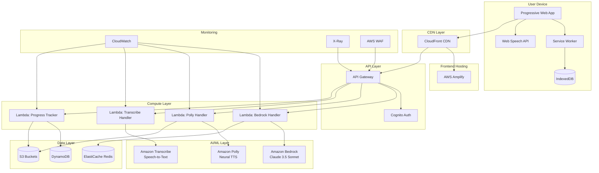
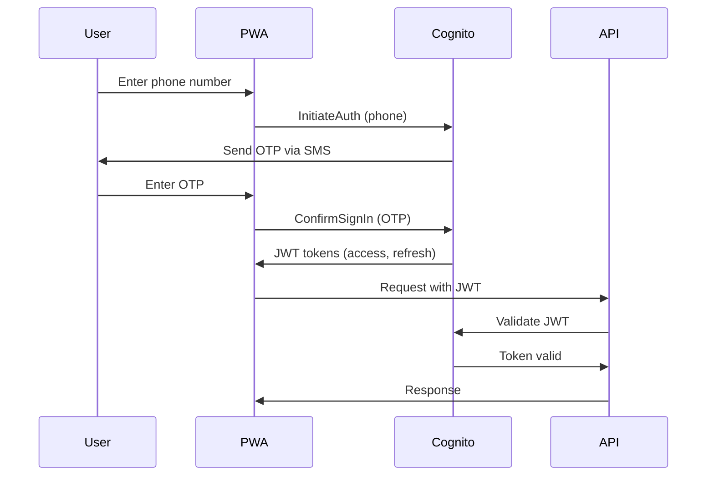
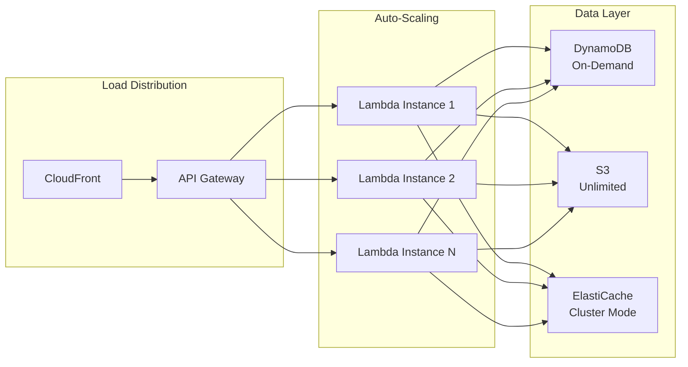
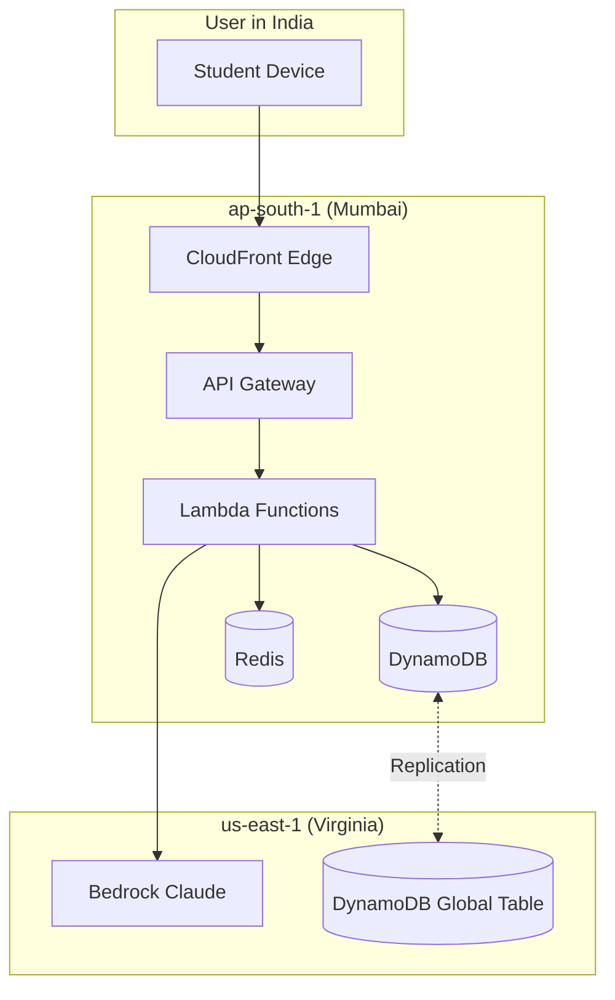
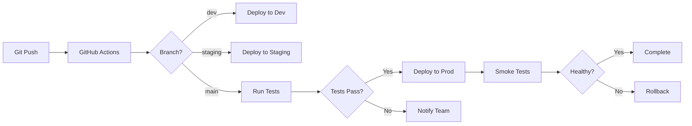
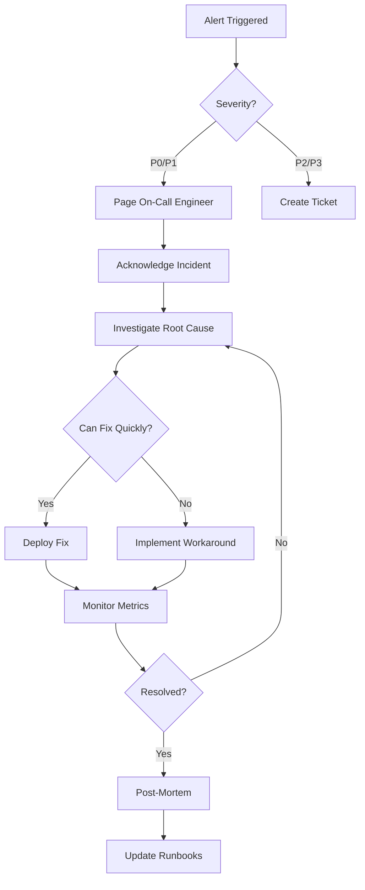

# Design Document: Pragya Shiksha

## 1. Project Overview

### 1.1 Solution Name
**Pragya Shiksha** - Voice-First Vernacular AI Teacher for Rural India

### 1.2 Problem Statement
**AI for Communities, Access & Public Impact**: Addressing the education gap for rural students who lack access to quality teachers, have limited internet connectivity, and require education in their native languages.

### 1.3 Target Users
- **Primary Users**: 5 crore+ rural students (Classes 6-12) across India
- **Languages**: 12+ regional languages (Hindi, Tamil, Telugu, Bengali, Marathi, Gujarati, Kannada, Malayalam, Odia, Punjabi, Assamese, Urdu)
- **Device Constraints**: Basic smartphones (₹3000 price point, 2GB RAM, limited storage)
- **Connectivity**: Intermittent or no internet access (2G/3G networks)

### 1.4 Core Innovation
- **Offline-First**: Full functionality without internet after initial lesson pack download
- **Voice-First**: Natural conversation-based learning (no typing required)
- **Vernacular**: Native language support with cultural context understanding
- **Accessible**: Works on basic smartphones, no app store required (PWA)

### 1.5 Success Metrics
- Load time < 3 seconds on 3G networks
- Lesson pack size < 50MB per subject
- Voice recognition accuracy > 85% in noisy environments
- Offline functionality for 7+ days without sync
- Support 10,000+ concurrent users per region

## 2. System Architecture

### 2.1 High-Level Architecture



### 2.2 Architecture Layers


#### 2.2.1 Frontend Layer

**Technology Stack:**
- React 18.2+ with TypeScript
- Vite 5.0+ for build tooling
- Tailwind CSS 3.4+ for styling
- Workbox 7.0+ for Service Worker management
- Dexie.js for IndexedDB abstraction

**Key Components:**
```typescript
// Component Structure
src/
├── components/
│   ├── VoiceInput/          // Microphone capture, audio visualization
│   ├── AudioPlayer/         // Polly audio playback with caching
│   ├── LessonViewer/        // Lesson content display
│   ├── ProgressTracker/     // Visual progress indicators
│   └── OfflineIndicator/    // Network status display
├── hooks/
│   ├── useVoiceRecognition  // Web Speech API + fallback
│   ├── useOfflineSync       // Background sync management
│   └── useAudioCache        // Audio file caching logic
├── services/
│   ├── api.service.ts       // API client with offline queue
│   ├── db.service.ts        // IndexedDB operations
│   └── sw.service.ts        // Service Worker communication
└── workers/
    └── service-worker.ts    // PWA offline logic
```

**Design Principles:**
- **Mobile-First**: Touch targets minimum 48x48px
- **High Contrast**: WCAG AAA compliance for outdoor visibility
- **Large Typography**: Minimum 16px base font size
- **Minimal UI**: Focus on voice interaction, reduce visual complexity
- **Gesture Support**: Swipe navigation for lesson progression


#### 2.2.2 CDN & Hosting Layer

**Amazon CloudFront Configuration:**
- **Edge Locations**: 50+ locations across India (Mumbai, Delhi, Chennai, Bangalore, Hyderabad)
- **Cache Behaviors**:
  - Static assets (JS, CSS, images): Cache for 1 year, immutable
  - Lesson packs: Cache for 30 days, versioned
  - Audio files: Cache for 7 days, compressed
  - API responses: No cache (dynamic content)

**Caching Strategy:**
```javascript
// CloudFront Cache Policy
{
  "static-assets": {
    "TTL": 31536000,  // 1 year
    "compress": true,
    "headers": ["Accept-Encoding"]
  },
  "lesson-packs": {
    "TTL": 2592000,   // 30 days
    "compress": true,
    "queryStrings": ["version", "language"]
  },
  "audio-cache": {
    "TTL": 604800,    // 7 days
    "compress": false, // Already compressed
    "headers": ["Range"] // Support partial content
  }
}
```

**AWS Amplify Hosting:**
- Automatic HTTPS with ACM certificates
- CI/CD integration with GitHub
- Atomic deployments with instant rollback
- Custom domain support (pragyashiksha.in)
- Branch-based environments (dev, staging, prod)


#### 2.2.3 API Layer

**Amazon API Gateway (REST API):**
- **Endpoint**: `https://api.pragyashiksha.in/v1`
- **Authentication**: Amazon Cognito JWT tokens
- **Rate Limiting**: 100 requests/minute per user
- **CORS**: Enabled for PWA domain

**API Endpoints:**

| Method | Endpoint | Description | Auth Required |
|--------|----------|-------------|---------------|
| POST | `/chat` | Send message to AI teacher | Yes |
| POST | `/speak` | Convert text to speech | Yes |
| POST | `/transcribe` | Convert speech to text | Yes |
| POST | `/progress` | Save student progress | Yes |
| GET | `/content/{lesson_id}` | Fetch lesson content | Yes |
| GET | `/lessons` | List available lessons | Yes |
| POST | `/sync` | Sync offline data | Yes |
| POST | `/auth/register` | Register new student | No |
| POST | `/auth/login` | Student login | No |

**Request/Response Examples:**

```json
// POST /chat
{
  "student_id": "STU123456",
  "message": "मुझे गणित में मदद चाहिए",
  "language": "hi",
  "lesson_context": {
    "lesson_id": "MATH_6_01",
    "grade": 6,
    "subject": "mathematics"
  }
}

// Response
{
  "response": "बिल्कुल! मैं आपकी गणित में मदद करूंगा। आप किस टॉपिक पर काम करना चाहते हैं?",
  "audio_url": "https://cdn.pragyashiksha.in/audio/abc123.mp3",
  "timestamp": "2026-02-14T10:30:00Z",
  "next_prompt": "अंकगणित, बीजगणित, या ज्यामिति?"
}
```


#### 2.2.4 Compute Layer

**AWS Lambda Functions:**

**1. Bedrock Handler (`bedrock_handler.py`)**
```python
# Lambda Configuration
Runtime: Python 3.11
Memory: 512 MB
Timeout: 30 seconds
Environment Variables:
  - BEDROCK_MODEL_ID: anthropic.claude-3-5-sonnet-20241022-v2:0
  - REDIS_ENDPOINT: cache.pragyashiksha.in:6379
  - MAX_TOKENS: 1000

# Function Logic
import boto3
import json
from redis import Redis

bedrock = boto3.client('bedrock-runtime', region_name='us-east-1')
redis_client = Redis(host=os.environ['REDIS_ENDPOINT'])

def lambda_handler(event, context):
    body = json.loads(event['body'])
    student_id = body['student_id']
    message = body['message']
    language = body['language']
    lesson_context = body.get('lesson_context', {})
    
    # Check cache for similar queries
    cache_key = f"chat:{student_id}:{hash(message)}"
    cached = redis_client.get(cache_key)
    if cached:
        return {'statusCode': 200, 'body': cached}
    
    # Build prompt with cultural context
    system_prompt = build_system_prompt(language, lesson_context)
    
    # Call Bedrock
    response = bedrock.invoke_model(
        modelId=os.environ['BEDROCK_MODEL_ID'],
        body=json.dumps({
            "anthropic_version": "bedrock-2023-05-31",
            "max_tokens": int(os.environ['MAX_TOKENS']),
            "system": system_prompt,
            "messages": [{"role": "user", "content": message}]
        })
    )
    
    result = json.loads(response['body'].read())
    response_text = result['content'][0]['text']
    
    # Cache response
    redis_client.setex(cache_key, 3600, json.dumps(response_text))
    
    return {
        'statusCode': 200,
        'body': json.dumps({'response': response_text})
    }
```


**2. Polly Handler (`polly_handler.py`)**
```python
# Lambda Configuration
Runtime: Python 3.11
Memory: 256 MB
Timeout: 15 seconds
Environment Variables:
  - S3_AUDIO_BUCKET: pragyashiksha-audio-cache
  - POLLY_ENGINE: neural

import boto3
import hashlib

polly = boto3.client('polly', region_name='ap-south-1')
s3 = boto3.client('s3')

VOICE_MAP = {
    'hi': 'Kajal',      # Hindi (Neural)
    'ta': 'Anjali',     # Tamil (Neural - coming soon, use Standard)
    'te': 'Aditi',      # Telugu (Standard)
    'bn': 'Aditi',      # Bengali (Standard)
    'mr': 'Aditi',      # Marathi (Standard)
}

def lambda_handler(event, context):
    body = json.loads(event['body'])
    text = body['text']
    language = body['language']
    use_cache = body.get('cache', True)
    
    # Generate cache key
    cache_key = hashlib.md5(f"{text}:{language}".encode()).hexdigest()
    s3_key = f"audio/{language}/{cache_key}.mp3"
    
    # Check S3 cache
    if use_cache:
        try:
            url = s3.generate_presigned_url(
                'get_object',
                Params={'Bucket': os.environ['S3_AUDIO_BUCKET'], 'Key': s3_key},
                ExpiresIn=86400
            )
            return {'statusCode': 200, 'body': json.dumps({'audio_url': url})}
        except:
            pass
    
    # Generate speech
    response = polly.synthesize_speech(
        Text=text,
        OutputFormat='mp3',
        VoiceId=VOICE_MAP.get(language, 'Aditi'),
        Engine='neural' if language in ['hi'] else 'standard',
        SampleRate='16000',  # Lower for bandwidth
        TextType='text'
    )
    
    # Save to S3
    audio_stream = response['AudioStream'].read()
    s3.put_object(
        Bucket=os.environ['S3_AUDIO_BUCKET'],
        Key=s3_key,
        Body=audio_stream,
        ContentType='audio/mpeg'
    )
    
    url = s3.generate_presigned_url('get_object',
        Params={'Bucket': os.environ['S3_AUDIO_BUCKET'], 'Key': s3_key},
        ExpiresIn=86400
    )
    
    return {'statusCode': 200, 'body': json.dumps({'audio_url': url})}
```


**3. Transcribe Handler (`transcribe_handler.py`)**
```python
# Lambda Configuration
Runtime: Python 3.11
Memory: 256 MB
Timeout: 60 seconds
Environment Variables:
  - S3_UPLOAD_BUCKET: pragyashiksha-uploads

import boto3
import uuid
import time

transcribe = boto3.client('transcribe', region_name='ap-south-1')
s3 = boto3.client('s3')

LANGUAGE_CODE_MAP = {
    'hi': 'hi-IN',
    'ta': 'ta-IN',
    'te': 'te-IN',
    'bn': 'bn-IN',
    'mr': 'mr-IN',
}

def lambda_handler(event, context):
    body = json.loads(event['body'])
    audio_base64 = body['audio_blob']
    language = body['language']
    
    # Upload audio to S3
    job_name = f"transcribe-{uuid.uuid4()}"
    s3_key = f"uploads/{job_name}.wav"
    
    audio_bytes = base64.b64decode(audio_base64)
    s3.put_object(
        Bucket=os.environ['S3_UPLOAD_BUCKET'],
        Key=s3_key,
        Body=audio_bytes
    )
    
    # Start transcription job
    transcribe.start_transcription_job(
        TranscriptionJobName=job_name,
        Media={'MediaFileUri': f"s3://{os.environ['S3_UPLOAD_BUCKET']}/{s3_key}"},
        MediaFormat='wav',
        LanguageCode=LANGUAGE_CODE_MAP.get(language, 'hi-IN'),
        Settings={
            'ShowSpeakerLabels': False,
            'MaxSpeakerLabels': 1
        }
    )
    
    # Poll for completion (max 45 seconds)
    for _ in range(45):
        status = transcribe.get_transcription_job(TranscriptionJobName=job_name)
        if status['TranscriptionJob']['TranscriptionJobStatus'] == 'COMPLETED':
            transcript = status['TranscriptionJob']['Transcript']['TranscriptFileUri']
            # Fetch transcript
            import requests
            result = requests.get(transcript).json()
            text = result['results']['transcripts'][0]['transcript']
            return {'statusCode': 200, 'body': json.dumps({'transcript': text})}
        time.sleep(1)
    
    return {'statusCode': 408, 'body': json.dumps({'error': 'Timeout'})}
```


**4. Progress Tracker (`progress_tracker.py`)**
```python
# Lambda Configuration
Runtime: Python 3.11
Memory: 256 MB
Timeout: 10 seconds

import boto3
from datetime import datetime
import json

dynamodb = boto3.resource('dynamodb', region_name='ap-south-1')
progress_table = dynamodb.Table('PragyaShiksha-Progress')
students_table = dynamodb.Table('PragyaShiksha-Students')

def lambda_handler(event, context):
    body = json.loads(event['body'])
    student_id = body['student_id']
    lesson_id = body['lesson_id']
    score = body.get('score', 0)
    time_spent = body.get('time_spent', 0)
    
    timestamp = datetime.utcnow().isoformat()
    
    # Save progress
    progress_table.put_item(Item={
        'student_id': student_id,
        'timestamp': timestamp,
        'lesson_id': lesson_id,
        'score': score,
        'time_spent': time_spent,
        'completed': score >= 70
    })
    
    # Update student aggregate stats
    students_table.update_item(
        Key={'student_id': student_id},
        UpdateExpression='ADD total_time_spent :time, lessons_completed :inc',
        ExpressionAttributeValues={
            ':time': time_spent,
            ':inc': 1 if score >= 70 else 0
        }
    )
    
    return {
        'statusCode': 200,
        'body': json.dumps({'saved': True, 'timestamp': timestamp})
    }
```

**Cold Start Optimization:**
- Provisioned concurrency for high-traffic functions (bedrock_handler)
- Lambda SnapStart for Java-based functions (if needed)
- Minimal dependencies, use Lambda layers for shared code
- Keep functions warm with CloudWatch Events (ping every 5 minutes)


#### 2.2.5 AI/ML Layer

**Amazon Bedrock with Claude 3.5 Sonnet:**

**Model Configuration:**
- Model ID: `anthropic.claude-3-5-sonnet-20241022-v2:0`
- Region: `us-east-1` (primary), `ap-south-1` (failover)
- Max Tokens: 1000 (optimized for conversational responses)
- Temperature: 0.7 (balanced creativity and consistency)

**Prompt Engineering for Rural Context:**

```python
def build_system_prompt(language, lesson_context):
    """Build culturally-aware system prompt"""
    
    base_prompt = f"""You are Pragya, an AI teacher helping rural Indian students learn in {language}.

TEACHING PRINCIPLES:
1. Use simple, conversational language appropriate for Classes 6-12
2. Relate concepts to rural life (farming, local festivals, daily activities)
3. Be patient and encouraging - many students are first-generation learners
4. Break complex topics into small, digestible steps
5. Use Socratic method - ask questions to guide learning
6. Provide examples from Indian context (cricket, Bollywood, local heroes)

CULTURAL CONTEXT:
- Student may have limited prior education
- Family may not understand importance of education
- Student may need to balance studies with farm/household work
- Celebrate small wins to build confidence

RESPONSE FORMAT:
- Keep responses under 100 words
- Use simple vocabulary (avoid English unless necessary)
- End with an engaging question to continue conversation
- Be warm and supportive in tone
"""
    
    if lesson_context:
        subject = lesson_context.get('subject', '')
        grade = lesson_context.get('grade', '')
        base_prompt += f"\n\nCURRENT LESSON: Grade {grade} {subject}"
    
    return base_prompt
```


**Amazon Polly (Text-to-Speech):**

**Voice Selection Strategy:**
| Language | Voice ID | Engine | Quality | Availability |
|----------|----------|--------|---------|--------------|
| Hindi (hi) | Kajal | Neural | High | Available |
| Tamil (ta) | Anjali | Standard | Medium | Available |
| Telugu (te) | Aditi | Standard | Medium | Available |
| Bengali (bn) | Aditi | Standard | Medium | Available |
| Marathi (mr) | Aditi | Standard | Medium | Available |
| Gujarati (gu) | Aditi | Standard | Medium | Available |

**Audio Optimization:**
- Sample Rate: 16kHz (sufficient for voice, reduces file size)
- Bitrate: 32kbps (optimized for mobile networks)
- Format: MP3 (universal browser support)
- SSML Support: For emphasis, pauses, pronunciation

**Example SSML Usage:**
```xml
<speak>
    नमस्ते! <break time="500ms"/> 
    आज हम <emphasis level="strong">गणित</emphasis> पढ़ेंगे।
    <prosody rate="slow">ध्यान से सुनो।</prosody>
</speak>
```

**Amazon Transcribe (Speech-to-Text):**

**Configuration:**
- Language Models: Custom vocabulary for educational terms
- Noise Reduction: Enabled for rural environments
- Speaker Diarization: Disabled (single speaker)
- Automatic Language Detection: Disabled (language pre-selected)

**Accuracy Improvements:**
```python
# Custom vocabulary for educational terms
CUSTOM_VOCABULARY = {
    'hi-IN': [
        'गणित', 'बीजगणित', 'ज्यामिति', 'त्रिकोणमिति',
        'भौतिकी', 'रसायन', 'जीवविज्ञान',
        'इतिहास', 'भूगोल', 'नागरिकशास्त्र'
    ],
    'ta-IN': ['கணிதம்', 'இயற்பியல்', 'வேதியியல்'],
    # ... other languages
}
```


#### 2.2.6 Data Layer

**Amazon DynamoDB Tables:**

**1. Students Table**
```json
{
  "TableName": "PragyaShiksha-Students",
  "KeySchema": [
    {"AttributeName": "student_id", "KeyType": "HASH"}
  ],
  "AttributeDefinitions": [
    {"AttributeName": "student_id", "AttributeType": "S"},
    {"AttributeName": "phone_number", "AttributeType": "S"}
  ],
  "GlobalSecondaryIndexes": [
    {
      "IndexName": "phone-index",
      "KeySchema": [{"AttributeName": "phone_number", "KeyType": "HASH"}],
      "Projection": {"ProjectionType": "ALL"}
    }
  ],
  "BillingMode": "PAY_PER_REQUEST",
  "StreamSpecification": {
    "StreamEnabled": true,
    "StreamViewType": "NEW_AND_OLD_IMAGES"
  }
}

// Sample Item
{
  "student_id": "STU123456",
  "name": "राज कुमार",
  "phone_number": "+919876543210",
  "grade": 8,
  "language": "hi",
  "village": "रामपुर",
  "district": "बाराबंकी",
  "state": "उत्तर प्रदेश",
  "created_at": "2026-01-15T10:00:00Z",
  "last_active": "2026-02-14T09:30:00Z",
  "total_time_spent": 7200,  // seconds
  "lessons_completed": 15,
  "current_streak": 5  // days
}
```


**2. Progress Table**
```json
{
  "TableName": "PragyaShiksha-Progress",
  "KeySchema": [
    {"AttributeName": "student_id", "KeyType": "HASH"},
    {"AttributeName": "timestamp", "KeyType": "RANGE"}
  ],
  "AttributeDefinitions": [
    {"AttributeName": "student_id", "AttributeType": "S"},
    {"AttributeName": "timestamp", "AttributeType": "S"},
    {"AttributeName": "lesson_id", "AttributeType": "S"}
  ],
  "GlobalSecondaryIndexes": [
    {
      "IndexName": "lesson-index",
      "KeySchema": [
        {"AttributeName": "lesson_id", "KeyType": "HASH"},
        {"AttributeName": "timestamp", "KeyType": "RANGE"}
      ],
      "Projection": {"ProjectionType": "ALL"}
    }
  ],
  "BillingMode": "PAY_PER_REQUEST",
  "TimeToLiveSpecification": {
    "Enabled": true,
    "AttributeName": "ttl"
  }
}

// Sample Item
{
  "student_id": "STU123456",
  "timestamp": "2026-02-14T10:30:00Z",
  "lesson_id": "MATH_8_ALGEBRA_01",
  "score": 85,
  "time_spent": 1200,  // seconds
  "completed": true,
  "attempts": 2,
  "questions_answered": 10,
  "questions_correct": 8,
  "ttl": 1735689600  // 1 year retention
}
```


**3. Analytics Table**
```json
{
  "TableName": "PragyaShiksha-Analytics",
  "KeySchema": [
    {"AttributeName": "metric_type", "KeyType": "HASH"},
    {"AttributeName": "timestamp", "KeyType": "RANGE"}
  ],
  "AttributeDefinitions": [
    {"AttributeName": "metric_type", "AttributeType": "S"},
    {"AttributeName": "timestamp", "AttributeType": "S"}
  ],
  "BillingMode": "PAY_PER_REQUEST"
}

// Sample Items
{
  "metric_type": "daily_active_users",
  "timestamp": "2026-02-14",
  "count": 12500,
  "by_language": {"hi": 5000, "ta": 3000, "te": 2500, "bn": 2000}
}

{
  "metric_type": "lesson_completion_rate",
  "timestamp": "2026-02-14",
  "lesson_id": "MATH_8_ALGEBRA_01",
  "completion_rate": 0.78,
  "avg_score": 72,
  "avg_time_spent": 1350
}
```

**Amazon S3 Buckets:**

**1. Lesson Content Bucket (`pragyashiksha-content`)**
```
Structure:
/lessons/
  /{grade}/
    /{subject}/
      /{language}/
        /lesson-pack.json      // Lesson metadata
        /content.md            // Lesson content
        /images/               // Compressed images (WebP)
        /exercises.json        // Practice questions

Example: /lessons/8/mathematics/hi/algebra-01/
```

**2. Audio Cache Bucket (`pragyashiksha-audio-cache`)**
```
Structure:
/audio/
  /{language}/
    /{hash}.mp3              // Cached Polly audio

Lifecycle Policy:
- Delete files older than 30 days
- Transition to Glacier after 7 days (if not accessed)
```

**3. Student Uploads Bucket (`pragyashiksha-uploads`)**
```
Structure:
/uploads/
  /{student_id}/
    /{timestamp}.wav         // Voice recordings

Lifecycle Policy:
- Delete after 24 hours (after transcription)
```


**Amazon ElastiCache (Redis):**

**Configuration:**
- Node Type: `cache.t3.micro` (dev), `cache.r6g.large` (prod)
- Engine: Redis 7.0
- Cluster Mode: Enabled (3 shards, 1 replica each)
- Encryption: In-transit and at-rest

**Cache Keys:**
```redis
# Chat response cache
chat:{student_id}:{message_hash} -> JSON response (TTL: 1 hour)

# Lesson content cache
lesson:{lesson_id}:{language} -> JSON content (TTL: 24 hours)

# Student session
session:{student_id} -> JSON session data (TTL: 30 minutes)

# Rate limiting
ratelimit:{student_id}:{endpoint} -> counter (TTL: 1 minute)

# Audio URL cache
audio:{text_hash}:{language} -> S3 URL (TTL: 7 days)
```

## 3. Offline-First Design

### 3.1 Service Worker Implementation

```typescript
// service-worker.ts
import { precacheAndRoute } from 'workbox-precaching';
import { registerRoute } from 'workbox-routing';
import { CacheFirst, NetworkFirst, StaleWhileRevalidate } from 'workbox-strategies';
import { ExpirationPlugin } from 'workbox-expiration';

// Precache static assets
precacheAndRoute(self.__WB_MANIFEST);

// Cache lesson packs (Cache First)
registerRoute(
  ({url}) => url.pathname.startsWith('/lessons/'),
  new CacheFirst({
    cacheName: 'lesson-packs',
    plugins: [
      new ExpirationPlugin({
        maxEntries: 50,
        maxAgeSeconds: 30 * 24 * 60 * 60, // 30 days
      }),
    ],
  })
);

// Cache audio files (Cache First)
registerRoute(
  ({url}) => url.pathname.includes('/audio/'),
  new CacheFirst({
    cacheName: 'audio-cache',
    plugins: [
      new ExpirationPlugin({
        maxEntries: 200,
        maxAgeSeconds: 7 * 24 * 60 * 60, // 7 days
      }),
    ],
  })
);

// API responses (Network First with offline fallback)
registerRoute(
  ({url}) => url.origin === 'https://api.pragyashiksha.in',
  new NetworkFirst({
    cacheName: 'api-cache',
    networkTimeoutSeconds: 5,
    plugins: [
      new ExpirationPlugin({
        maxEntries: 100,
        maxAgeSeconds: 24 * 60 * 60, // 1 day
      }),
    ],
  })
);

// Background sync for offline actions
self.addEventListener('sync', (event) => {
  if (event.tag === 'sync-progress') {
    event.waitUntil(syncOfflineProgress());
  }
});

async function syncOfflineProgress() {
  const db = await openDB('pragya-offline', 1);
  const pendingItems = await db.getAll('pending-sync');
  
  for (const item of pendingItems) {
    try {
      await fetch('https://api.pragyashiksha.in/v1/sync', {
        method: 'POST',
        body: JSON.stringify(item),
        headers: {'Content-Type': 'application/json'}
      });
      await db.delete('pending-sync', item.id);
    } catch (error) {
      console.error('Sync failed:', error);
    }
  }
}
```


### 3.2 IndexedDB Schema

```typescript
// db.service.ts
import Dexie, { Table } from 'dexie';

interface Lesson {
  id: string;
  grade: number;
  subject: string;
  language: string;
  title: string;
  content: string;
  exercises: any[];
  downloaded_at: Date;
  size_bytes: number;
}

interface AudioCache {
  id: string;
  text_hash: string;
  language: string;
  audio_blob: Blob;
  cached_at: Date;
}

interface OfflineProgress {
  id: string;
  student_id: string;
  lesson_id: string;
  score: number;
  time_spent: number;
  timestamp: Date;
  synced: boolean;
}

interface StudentSession {
  student_id: string;
  name: string;
  grade: number;
  language: string;
  auth_token: string;
  last_sync: Date;
}

class PragyaDB extends Dexie {
  lessons!: Table<Lesson, string>;
  audioCache!: Table<AudioCache, string>;
  offlineProgress!: Table<OfflineProgress, string>;
  session!: Table<StudentSession, string>;

  constructor() {
    super('PragyaShikshaDB');
    this.version(1).stores({
      lessons: 'id, grade, subject, language, downloaded_at',
      audioCache: 'id, text_hash, language, cached_at',
      offlineProgress: 'id, student_id, lesson_id, synced, timestamp',
      session: 'student_id'
    });
  }
}

export const db = new PragyaDB();
```


### 3.3 Offline Sync Strategy

```typescript
// sync.service.ts
export class OfflineSyncService {
  private syncInProgress = false;

  async syncWhenOnline() {
    if (!navigator.onLine || this.syncInProgress) return;
    
    this.syncInProgress = true;
    
    try {
      // 1. Upload pending progress
      await this.syncProgress();
      
      // 2. Download new lesson packs
      await this.downloadNewLessons();
      
      // 3. Update student profile
      await this.syncProfile();
      
      // 4. Clean old cache
      await this.cleanCache();
      
    } finally {
      this.syncInProgress = false;
    }
  }

  private async syncProgress() {
    const pending = await db.offlineProgress
      .where('synced').equals(false)
      .toArray();
    
    for (const item of pending) {
      try {
        await fetch('/api/v1/progress', {
          method: 'POST',
          body: JSON.stringify(item),
          headers: this.getAuthHeaders()
        });
        
        await db.offlineProgress.update(item.id, { synced: true });
      } catch (error) {
        console.error('Failed to sync progress:', error);
      }
    }
  }

  private async downloadNewLessons() {
    const session = await db.session.get(this.getStudentId());
    if (!session) return;
    
    // Fetch available lessons for student's grade
    const response = await fetch(
      `/api/v1/lessons?grade=${session.grade}&language=${session.language}`,
      { headers: this.getAuthHeaders() }
    );
    
    const availableLessons = await response.json();
    const downloaded = await db.lessons.toArray();
    const downloadedIds = new Set(downloaded.map(l => l.id));
    
    // Download missing lessons (max 5 at a time)
    const toDownload = availableLessons
      .filter(l => !downloadedIds.has(l.id))
      .slice(0, 5);
    
    for (const lesson of toDownload) {
      await this.downloadLesson(lesson.id);
    }
  }

  private async downloadLesson(lessonId: string) {
    const response = await fetch(`/api/v1/content/${lessonId}`, {
      headers: this.getAuthHeaders()
    });
    
    const lessonData = await response.json();
    
    // Compress and store
    await db.lessons.add({
      ...lessonData,
      downloaded_at: new Date(),
      size_bytes: JSON.stringify(lessonData).length
    });
  }

  private async cleanCache() {
    // Remove lessons older than 30 days
    const thirtyDaysAgo = new Date();
    thirtyDaysAgo.setDate(thirtyDaysAgo.getDate() - 30);
    
    await db.lessons
      .where('downloaded_at')
      .below(thirtyDaysAgo)
      .delete();
    
    // Remove audio cache older than 7 days
    const sevenDaysAgo = new Date();
    sevenDaysAgo.setDate(sevenDaysAgo.getDate() - 7);
    
    await db.audioCache
      .where('cached_at')
      .below(sevenDaysAgo)
      .delete();
  }
}
```


### 3.4 Lesson Pack Compression

**Compression Strategy:**
```typescript
// compression.service.ts
import pako from 'pako';

export class CompressionService {
  async compressLessonPack(lesson: any): Promise<Blob> {
    const jsonString = JSON.stringify(lesson);
    const compressed = pako.gzip(jsonString);
    return new Blob([compressed], { type: 'application/gzip' });
  }

  async decompressLessonPack(blob: Blob): Promise<any> {
    const arrayBuffer = await blob.arrayBuffer();
    const decompressed = pako.ungzip(new Uint8Array(arrayBuffer), { to: 'string' });
    return JSON.parse(decompressed);
  }

  // Differential sync - only download changed content
  async getDiff(localVersion: string, remoteVersion: string): Promise<any> {
    const response = await fetch(
      `/api/v1/content/diff?local=${localVersion}&remote=${remoteVersion}`
    );
    return response.json();
  }
}

// Lesson pack size optimization
// Target: < 50MB per subject (all lessons for one grade)
// Breakdown:
// - Text content: ~5MB (compressed)
// - Images: ~20MB (WebP, compressed)
// - Audio: ~20MB (32kbps MP3)
// - Exercises: ~5MB (JSON)
```

## 4. Voice Interface Design

### 4.1 Voice Input Implementation

```typescript
// useVoiceRecognition.ts
import { useState, useEffect, useRef } from 'react';

export function useVoiceRecognition(language: string) {
  const [isListening, setIsListening] = useState(false);
  const [transcript, setTranscript] = useState('');
  const [audioLevel, setAudioLevel] = useState(0);
  const recognitionRef = useRef<any>(null);
  const mediaRecorderRef = useRef<MediaRecorder | null>(null);
  const audioChunksRef = useRef<Blob[]>([]);

  useEffect(() => {
    // Try Web Speech API first (works offline)
    if ('webkitSpeechRecognition' in window) {
      const SpeechRecognition = (window as any).webkitSpeechRecognition;
      recognitionRef.current = new SpeechRecognition();
      recognitionRef.current.continuous = false;
      recognitionRef.current.interimResults = true;
      recognitionRef.current.lang = getLanguageCode(language);

      recognitionRef.current.onresult = (event: any) => {
        const result = event.results[event.results.length - 1];
        setTranscript(result[0].transcript);
      };
    }
  }, [language]);

  const startListening = async () => {
    setIsListening(true);
    audioChunksRef.current = [];

    // Start Web Speech API
    if (recognitionRef.current) {
      try {
        recognitionRef.current.start();
      } catch (error) {
        console.error('Web Speech API failed:', error);
      }
    }

    // Also record audio for server-side transcription (fallback)
    try {
      const stream = await navigator.mediaDevices.getUserMedia({ 
        audio: {
          echoCancellation: true,
          noiseSuppression: true,
          autoGainControl: true
        } 
      });

      // Audio level visualization
      const audioContext = new AudioContext();
      const analyser = audioContext.createAnalyser();
      const microphone = audioContext.createMediaStreamSource(stream);
      microphone.connect(analyser);
      analyser.fftSize = 256;
      const dataArray = new Uint8Array(analyser.frequencyBinCount);

      const updateLevel = () => {
        if (!isListening) return;
        analyser.getByteFrequencyData(dataArray);
        const average = dataArray.reduce((a, b) => a + b) / dataArray.length;
        setAudioLevel(average / 255);
        requestAnimationFrame(updateLevel);
      };
      updateLevel();

      // Record audio
      mediaRecorderRef.current = new MediaRecorder(stream);
      mediaRecorderRef.current.ondataavailable = (event) => {
        audioChunksRef.current.push(event.data);
      };
      mediaRecorderRef.current.start();

      // Auto-stop after 30 seconds
      setTimeout(() => stopListening(), 30000);

    } catch (error) {
      console.error('Microphone access failed:', error);
    }
  };

  const stopListening = async () => {
    setIsListening(false);

    if (recognitionRef.current) {
      recognitionRef.current.stop();
    }

    if (mediaRecorderRef.current && mediaRecorderRef.current.state !== 'inactive') {
      mediaRecorderRef.current.stop();

      // If Web Speech API failed, use server transcription
      if (!transcript) {
        const audioBlob = new Blob(audioChunksRef.current, { type: 'audio/wav' });
        const base64Audio = await blobToBase64(audioBlob);
        
        try {
          const response = await fetch('/api/v1/transcribe', {
            method: 'POST',
            body: JSON.stringify({ audio_blob: base64Audio, language }),
            headers: { 'Content-Type': 'application/json' }
          });
          const result = await response.json();
          setTranscript(result.transcript);
        } catch (error) {
          console.error('Server transcription failed:', error);
        }
      }
    }
  };

  return { isListening, transcript, audioLevel, startListening, stopListening };
}

function getLanguageCode(lang: string): string {
  const codes: Record<string, string> = {
    'hi': 'hi-IN',
    'ta': 'ta-IN',
    'te': 'te-IN',
    'bn': 'bn-IN',
    'mr': 'mr-IN',
  };
  return codes[lang] || 'hi-IN';
}

async function blobToBase64(blob: Blob): Promise<string> {
  return new Promise((resolve, reject) => {
    const reader = new FileReader();
    reader.onloadend = () => resolve(reader.result as string);
    reader.onerror = reject;
    reader.readAsDataURL(blob);
  });
}
```


### 4.2 Voice Output Implementation

```typescript
// useAudioPlayback.ts
import { useState, useRef } from 'react';
import { db } from './db.service';

export function useAudioPlayback() {
  const [isPlaying, setIsPlaying] = useState(false);
  const audioRef = useRef<HTMLAudioElement | null>(null);

  const speak = async (text: string, language: string) => {
    // Check cache first
    const textHash = hashString(text);
    const cached = await db.audioCache.get(`${textHash}-${language}`);

    if (cached) {
      playAudio(URL.createObjectURL(cached.audio_blob));
      return;
    }

    // Fetch from server
    try {
      const response = await fetch('/api/v1/speak', {
        method: 'POST',
        body: JSON.stringify({ text, language, cache: true }),
        headers: { 'Content-Type': 'application/json' }
      });

      const result = await response.json();

      if (result.audio_url) {
        // Download and cache
        const audioResponse = await fetch(result.audio_url);
        const audioBlob = await audioResponse.blob();

        await db.audioCache.add({
          id: `${textHash}-${language}`,
          text_hash: textHash,
          language,
          audio_blob: audioBlob,
          cached_at: new Date()
        });

        playAudio(URL.createObjectURL(audioBlob));
      }
    } catch (error) {
      console.error('Audio playback failed:', error);
      // Fallback to Web Speech API
      if ('speechSynthesis' in window) {
        const utterance = new SpeechSynthesisUtterance(text);
        utterance.lang = getLanguageCode(language);
        window.speechSynthesis.speak(utterance);
      }
    }
  };

  const playAudio = (url: string) => {
    if (audioRef.current) {
      audioRef.current.pause();
    }

    audioRef.current = new Audio(url);
    audioRef.current.play();
    setIsPlaying(true);

    audioRef.current.onended = () => setIsPlaying(false);
    audioRef.current.onerror = () => setIsPlaying(false);
  };

  const stop = () => {
    if (audioRef.current) {
      audioRef.current.pause();
      setIsPlaying(false);
    }
  };

  return { isPlaying, speak, stop };
}

function hashString(str: string): string {
  let hash = 0;
  for (let i = 0; i < str.length; i++) {
    const char = str.charCodeAt(i);
    hash = ((hash << 5) - hash) + char;
    hash = hash & hash;
  }
  return hash.toString(36);
}
```

### 4.3 Voice UI Components

```typescript
// VoiceInput.tsx
import React from 'react';
import { useVoiceRecognition } from '../hooks/useVoiceRecognition';

export function VoiceInput({ language, onTranscript }: Props) {
  const { isListening, transcript, audioLevel, startListening, stopListening } = 
    useVoiceRecognition(language);

  React.useEffect(() => {
    if (transcript) {
      onTranscript(transcript);
    }
  }, [transcript]);

  return (
    <div className="flex flex-col items-center p-6">
      {/* Microphone Button */}
      <button
        onClick={isListening ? stopListening : startListening}
        className={`w-24 h-24 rounded-full flex items-center justify-center
          ${isListening ? 'bg-red-500 animate-pulse' : 'bg-blue-500'}
          text-white shadow-lg active:scale-95 transition-transform`}
      >
        <MicrophoneIcon className="w-12 h-12" />
      </button>

      {/* Audio Level Visualization */}
      {isListening && (
        <div className="mt-4 flex gap-1">
          {[...Array(20)].map((_, i) => (
            <div
              key={i}
              className="w-2 bg-blue-500 rounded-full transition-all"
              style={{
                height: `${Math.max(4, audioLevel * 100 * (1 + Math.sin(i * 0.5)))}px`
              }}
            />
          ))}
        </div>
      )}

      {/* Transcript Display */}
      {transcript && (
        <div className="mt-4 p-4 bg-gray-100 rounded-lg max-w-md">
          <p className="text-lg text-gray-800">{transcript}</p>
        </div>
      )}

      {/* Instructions */}
      <p className="mt-4 text-sm text-gray-600 text-center">
        {isListening 
          ? 'सुन रहा हूँ... बोलें' 
          : 'माइक बटन दबाएं और बोलें'}
      </p>
    </div>
  );
}
```


## 5. API Specifications

### 5.1 Authentication Flow



### 5.2 Detailed API Endpoints

#### POST /v1/auth/register
Register a new student.

**Request:**
```json
{
  "phone_number": "+919876543210",
  "name": "राज कुमार",
  "grade": 8,
  "language": "hi",
  "village": "रामपुर",
  "district": "बाराबंकी",
  "state": "उत्तर प्रदेश"
}
```

**Response:**
```json
{
  "student_id": "STU123456",
  "message": "OTP sent to +919876543210",
  "session": "session-token-abc123"
}
```

#### POST /v1/auth/verify
Verify OTP and complete registration.

**Request:**
```json
{
  "session": "session-token-abc123",
  "otp": "123456"
}
```

**Response:**
```json
{
  "student_id": "STU123456",
  "access_token": "eyJhbGc...",
  "refresh_token": "eyJhbGc...",
  "expires_in": 3600
}
```


#### POST /v1/chat
Send a message to the AI teacher.

**Request:**
```json
{
  "student_id": "STU123456",
  "message": "मुझे बीजगणित समझाओ",
  "language": "hi",
  "lesson_context": {
    "lesson_id": "MATH_8_ALGEBRA_01",
    "grade": 8,
    "subject": "mathematics"
  }
}
```

**Response:**
```json
{
  "response": "बीजगणित गणित की एक शाखा है जहाँ हम अक्षरों का उपयोग करके संख्याओं को दर्शाते हैं। उदाहरण के लिए, अगर x = 5 है, तो 2x = 10। क्या आप कोई उदाहरण देखना चाहेंगे?",
  "audio_url": "https://cdn.pragyashiksha.in/audio/xyz789.mp3",
  "timestamp": "2026-02-14T10:30:00Z",
  "next_prompt": "हाँ, उदाहरण दिखाओ",
  "conversation_id": "CONV_ABC123"
}
```

**Error Response:**
```json
{
  "error": "rate_limit_exceeded",
  "message": "Too many requests. Please wait 1 minute.",
  "retry_after": 60
}
```

#### POST /v1/speak
Convert text to speech.

**Request:**
```json
{
  "text": "नमस्ते! आज हम गणित पढ़ेंगे।",
  "language": "hi",
  "cache": true
}
```

**Response:**
```json
{
  "audio_url": "https://cdn.pragyashiksha.in/audio/abc123.mp3",
  "duration_seconds": 3.5,
  "cached": false
}
```

#### POST /v1/transcribe
Convert speech to text.

**Request:**
```json
{
  "audio_blob": "data:audio/wav;base64,UklGRiQAAABXQVZF...",
  "language": "hi"
}
```

**Response:**
```json
{
  "transcript": "मुझे गणित में मदद चाहिए",
  "confidence": 0.92,
  "duration_seconds": 2.1
}
```


#### POST /v1/progress
Save student progress.

**Request:**
```json
{
  "student_id": "STU123456",
  "lesson_id": "MATH_8_ALGEBRA_01",
  "score": 85,
  "time_spent": 1200,
  "questions_answered": 10,
  "questions_correct": 8,
  "completed": true
}
```

**Response:**
```json
{
  "saved": true,
  "timestamp": "2026-02-14T10:30:00Z",
  "total_lessons_completed": 16,
  "current_streak": 5
}
```

#### GET /v1/lessons
List available lessons for student.

**Query Parameters:**
- `grade`: Student's grade (6-12)
- `language`: Preferred language code
- `subject`: Optional subject filter

**Response:**
```json
{
  "lessons": [
    {
      "lesson_id": "MATH_8_ALGEBRA_01",
      "title": "बीजगणित का परिचय",
      "subject": "mathematics",
      "grade": 8,
      "language": "hi",
      "duration_minutes": 30,
      "difficulty": "beginner",
      "prerequisites": [],
      "size_bytes": 4500000
    },
    {
      "lesson_id": "MATH_8_ALGEBRA_02",
      "title": "रैखिक समीकरण",
      "subject": "mathematics",
      "grade": 8,
      "language": "hi",
      "duration_minutes": 45,
      "difficulty": "intermediate",
      "prerequisites": ["MATH_8_ALGEBRA_01"],
      "size_bytes": 5200000
    }
  ],
  "total": 2
}
```

#### GET /v1/content/{lesson_id}
Fetch complete lesson content.

**Response:**
```json
{
  "lesson_id": "MATH_8_ALGEBRA_01",
  "title": "बीजगणित का परिचय",
  "content": "# बीजगणित\n\nबीजगणित गणित की वह शाखा है...",
  "exercises": [
    {
      "question": "अगर x = 5 है, तो 3x का मान क्या होगा?",
      "options": ["10", "15", "20", "25"],
      "correct_answer": "15",
      "explanation": "3 × 5 = 15"
    }
  ],
  "images": [
    {
      "url": "https://cdn.pragyashiksha.in/images/algebra-01.webp",
      "caption": "बीजगणित का उदाहरण"
    }
  ],
  "audio_intro": "https://cdn.pragyashiksha.in/audio/intro-algebra-01.mp3",
  "version": "1.0.0"
}
```

#### POST /v1/sync
Sync offline data when connection returns.

**Request:**
```json
{
  "student_id": "STU123456",
  "progress_items": [
    {
      "lesson_id": "MATH_8_ALGEBRA_01",
      "score": 85,
      "time_spent": 1200,
      "timestamp": "2026-02-14T10:30:00Z"
    }
  ],
  "last_sync": "2026-02-13T15:00:00Z"
}
```

**Response:**
```json
{
  "synced": true,
  "items_processed": 1,
  "new_lessons_available": 3,
  "profile_updated": true
}
```


## 6. Scalability Design

### 6.1 Horizontal Scaling



**Scaling Characteristics:**

| Component | Scaling Method | Limit | Cost Model |
|-----------|---------------|-------|------------|
| Lambda | Auto (concurrent executions) | 1000 default, 10000+ with quota | Pay per invocation |
| API Gateway | Auto | 10,000 RPS default | Pay per request |
| DynamoDB | On-demand auto-scaling | Unlimited | Pay per request |
| S3 | Unlimited | Unlimited | Pay per GB stored |
| CloudFront | Auto | Unlimited | Pay per GB transferred |
| ElastiCache | Manual (add nodes) | 500 nodes per cluster | Pay per node-hour |

### 6.2 Multi-Region Architecture

**Primary Region: us-east-1** (Bedrock availability)
**Secondary Region: ap-south-1** (Low latency for India)



**Failover Strategy:**
- Route 53 health checks on API Gateway
- Automatic failover to secondary region if primary fails
- DynamoDB Global Tables for data replication
- S3 Cross-Region Replication for content


### 6.3 Performance Targets

| Metric | Target | Measurement |
|--------|--------|-------------|
| Page Load Time (3G) | < 3 seconds | Lighthouse |
| API Response Time (p95) | < 500ms | CloudWatch |
| Bedrock Response Time | < 2 seconds | X-Ray |
| Polly TTS Generation | < 1 second | CloudWatch |
| Transcribe Processing | < 5 seconds | CloudWatch |
| Offline Mode Activation | < 100ms | Browser DevTools |
| Lesson Pack Download | < 30 seconds on 3G | Network throttling |
| Audio Playback Start | < 200ms | Browser metrics |

### 6.4 Capacity Planning

**Expected Load (Year 1):**
- Total Users: 5 crore (50 million)
- Daily Active Users: 10% = 5 million
- Peak Concurrent Users: 500,000
- Average Session Duration: 30 minutes
- API Requests per Session: 50

**Calculations:**
```
Peak RPS = (500,000 users × 50 requests) / (30 minutes × 60 seconds)
         = 25,000,000 / 1,800
         = ~14,000 RPS

Lambda Invocations per Day = 5,000,000 users × 50 requests
                            = 250 million invocations/day

DynamoDB Writes per Day = 5,000,000 users × 10 progress saves
                        = 50 million writes/day

S3 Storage (Lesson Packs) = 50MB × 6 grades × 5 subjects × 12 languages
                          = 18 GB (compressed)

Audio Cache Storage = 5,000,000 users × 20 audio files × 50KB
                    = 5 TB (with 7-day retention)
```

**Cost Estimation (Monthly):**
```
Lambda: 250M invocations × $0.20/1M = $50
API Gateway: 250M requests × $3.50/1M = $875
DynamoDB: 50M writes × $1.25/1M = $62.50
S3 Storage: 5TB × $0.023/GB = $117.50
CloudFront: 10TB transfer × $0.085/GB = $850
Bedrock: 250M tokens × $3/1M = $750
Polly: 100M characters × $4/1M = $400
Transcribe: 10M minutes × $0.024/min = $240,000 (optimize!)
ElastiCache: 3 nodes × $0.068/hr × 730hrs = $149

Total: ~$243,254/month (optimize Transcribe usage!)
```

**Optimization Strategies:**
- Use Web Speech API first (free, offline)
- Batch Transcribe jobs
- Cache aggressively
- Compress audio files
- Use spot instances for non-critical workloads


## 7. Security Design

### 7.1 Authentication & Authorization

**Amazon Cognito Configuration:**
```json
{
  "UserPool": {
    "PoolName": "PragyaShiksha-Users",
    "MfaConfiguration": "OPTIONAL",
    "Policies": {
      "PasswordPolicy": {
        "MinimumLength": 8,
        "RequireUppercase": false,
        "RequireLowercase": false,
        "RequireNumbers": true,
        "RequireSymbols": false
      }
    },
    "Schema": [
      {
        "Name": "phone_number",
        "AttributeDataType": "String",
        "Required": true,
        "Mutable": false
      },
      {
        "Name": "student_id",
        "AttributeDataType": "String",
        "Required": true,
        "Mutable": false
      }
    ],
    "AutoVerifiedAttributes": ["phone_number"],
    "UsernameAttributes": ["phone_number"],
    "AccountRecoverySetting": {
      "RecoveryMechanisms": [
        {
          "Name": "verified_phone_number",
          "Priority": 1
        }
      ]
    }
  }
}
```

**JWT Token Structure:**
```json
{
  "sub": "STU123456",
  "phone_number": "+919876543210",
  "cognito:groups": ["students"],
  "custom:grade": "8",
  "custom:language": "hi",
  "iss": "https://cognito-idp.ap-south-1.amazonaws.com/...",
  "exp": 1708000000,
  "iat": 1707996400
}
```

### 7.2 API Security

**API Gateway Configuration:**
```yaml
# API Gateway Resource Policy
{
  "Version": "2012-10-17",
  "Statement": [
    {
      "Effect": "Allow",
      "Principal": "*",
      "Action": "execute-api:Invoke",
      "Resource": "arn:aws:execute-api:*:*:*",
      "Condition": {
        "IpAddress": {
          "aws:SourceIp": [
            "0.0.0.0/0"  # Allow all (protected by Cognito + WAF)
          ]
        }
      }
    }
  ]
}

# Rate Limiting (per user)
UsagePlan:
  Throttle:
    BurstLimit: 200
    RateLimit: 100  # requests per second
  Quota:
    Limit: 10000    # requests per day
    Period: DAY
```

**AWS WAF Rules:**
```yaml
WebACL:
  Name: PragyaShiksha-WAF
  Rules:
    - Name: RateLimitRule
      Priority: 1
      Statement:
        RateBasedStatement:
          Limit: 2000  # requests per 5 minutes
          AggregateKeyType: IP
      Action:
        Block: {}
    
    - Name: GeoBlockRule
      Priority: 2
      Statement:
        GeoMatchStatement:
          CountryCodes: [IN]  # Only allow India
      Action:
        Allow: {}
    
    - Name: SQLInjectionRule
      Priority: 3
      Statement:
        ManagedRuleGroupStatement:
          VendorName: AWS
          Name: AWSManagedRulesSQLiRuleSet
      Action:
        Block: {}
    
    - Name: XSSRule
      Priority: 4
      Statement:
        ManagedRuleGroupStatement:
          VendorName: AWS
          Name: AWSManagedRulesKnownBadInputsRuleSet
      Action:
        Block: {}
```


### 7.3 Data Encryption

**Encryption at Rest:**
```yaml
# DynamoDB Encryption
DynamoDB:
  Encryption:
    Type: KMS
    KMSMasterKeyId: arn:aws:kms:ap-south-1:123456789012:key/abc-123
    SSEEnabled: true

# S3 Encryption
S3:
  BucketEncryption:
    ServerSideEncryptionConfiguration:
      - ServerSideEncryptionByDefault:
          SSEAlgorithm: AES256
        BucketKeyEnabled: true

# ElastiCache Encryption
ElastiCache:
  AtRestEncryptionEnabled: true
  TransitEncryptionEnabled: true
  AuthTokenEnabled: true
```

**Encryption in Transit:**
- All API calls use HTTPS (TLS 1.2+)
- CloudFront enforces HTTPS
- Certificate management via AWS ACM
- HSTS headers enabled

### 7.4 Privacy & Compliance

**GDPR Compliance:**
- Right to access: API endpoint for data export
- Right to deletion: Automated data deletion workflow
- Data minimization: Only collect necessary data
- Consent management: Explicit consent during registration

**COPPA Compliance (Children's Privacy):**
- Parental consent for users under 13
- No behavioral advertising
- No third-party data sharing
- Secure data storage

**Data Retention Policy:**
```python
# Lambda function for data cleanup
def cleanup_old_data():
    # Delete progress records older than 1 year
    one_year_ago = datetime.now() - timedelta(days=365)
    
    # Delete inactive student accounts (no activity for 2 years)
    two_years_ago = datetime.now() - timedelta(days=730)
    
    # Delete audio cache older than 7 days
    seven_days_ago = datetime.now() - timedelta(days=7)
    
    # Delete transcription uploads immediately after processing
```

**PII Handling:**
- Phone numbers hashed in logs
- Student names encrypted in database
- No sensitive data in CloudWatch logs
- Audit trail for all data access


## 8. Technology Stack Justification

### 8.1 Frontend Technologies

**React 18.2+ with TypeScript**
- **Why**: Component reusability, large ecosystem, excellent TypeScript support
- **Alternatives Considered**: Vue.js (smaller ecosystem), Svelte (less mature)
- **Trade-offs**: Larger bundle size, but better developer experience and community support

**Vite 5.0+**
- **Why**: Fast build times, excellent HMR, optimized production builds
- **Alternatives Considered**: Webpack (slower), Create React App (deprecated)
- **Trade-offs**: Newer tool, but significantly faster development experience

**Tailwind CSS 3.4+**
- **Why**: Utility-first, small bundle size with PurgeCSS, rapid development
- **Alternatives Considered**: Bootstrap (heavier), CSS Modules (more verbose)
- **Trade-offs**: Learning curve, but highly optimized for mobile-first design

**Progressive Web App (PWA)**
- **Why**: No app store required, installable, offline support, cross-platform
- **Alternatives Considered**: Native apps (expensive to maintain), React Native (still requires app store)
- **Trade-offs**: Limited native features, but perfect for our use case

### 8.2 Backend Technologies

**AWS Lambda (Python 3.11)**
- **Why**: Serverless, pay-per-use, auto-scaling, no server management
- **Alternatives Considered**: EC2 (requires management), ECS (more complex)
- **Trade-offs**: Cold starts, but optimized with provisioned concurrency

**Amazon API Gateway**
- **Why**: Managed service, built-in throttling, Cognito integration
- **Alternatives Considered**: ALB + Lambda (more complex), API on EC2 (requires management)
- **Trade-offs**: Cost at high scale, but perfect for our traffic patterns

**Amazon Bedrock (Claude 3.5 Sonnet)**
- **Why**: State-of-the-art language model, excellent multilingual support, managed service
- **Alternatives Considered**: OpenAI GPT-4 (more expensive), Self-hosted LLM (requires infrastructure)
- **Trade-offs**: Cost per token, but best quality for educational content

**Amazon Polly**
- **Why**: Native AWS integration, Neural voices for Hindi, pay-per-use
- **Alternatives Considered**: Google Cloud TTS (similar), ElevenLabs (expensive)
- **Trade-offs**: Limited Neural voices for Indian languages, but improving

**Amazon Transcribe**
- **Why**: Native AWS integration, supports Indian languages, custom vocabulary
- **Alternatives Considered**: Google Speech-to-Text (similar), Whisper (requires hosting)
- **Trade-offs**: Cost at scale, but best accuracy for Indian languages


### 8.3 Data Technologies

**Amazon DynamoDB**
- **Why**: NoSQL flexibility, serverless, pay-per-request, single-digit millisecond latency
- **Alternatives Considered**: RDS (requires provisioning), MongoDB Atlas (more expensive)
- **Trade-offs**: No complex queries, but perfect for key-value access patterns

**Amazon S3**
- **Why**: Unlimited storage, 99.999999999% durability, low cost, CDN integration
- **Alternatives Considered**: EFS (more expensive), EBS (not scalable)
- **Trade-offs**: Eventual consistency, but perfect for static content

**Amazon ElastiCache (Redis)**
- **Why**: In-memory caching, sub-millisecond latency, managed service
- **Alternatives Considered**: Memcached (less features), Self-hosted Redis (requires management)
- **Trade-offs**: Cost, but essential for performance

### 8.4 Infrastructure Technologies

**AWS CDK (Python)**
- **Why**: Infrastructure as Code, type-safe, reusable constructs, native AWS support
- **Alternatives Considered**: Terraform (multi-cloud but more verbose), CloudFormation (less developer-friendly)
- **Trade-offs**: AWS-only, but perfect for our AWS-centric architecture

**AWS Amplify**
- **Why**: Managed hosting, CI/CD, automatic HTTPS, branch deployments
- **Alternatives Considered**: Vercel (more expensive), Netlify (similar), S3 + CloudFront (manual setup)
- **Trade-offs**: Less control, but perfect for PWA hosting

**Amazon CloudFront**
- **Why**: Global CDN, 50+ India edge locations, low latency, DDoS protection
- **Alternatives Considered**: Cloudflare (similar), Akamai (more expensive)
- **Trade-offs**: Cost at high scale, but essential for performance

## 9. Deployment Strategy

### 9.1 Infrastructure as Code

**AWS CDK Stack Structure:**
```python
# cdk/app.py
from aws_cdk import App, Stack, Environment
from constructs import Construct

app = App()

# Shared resources
shared_stack = SharedResourcesStack(app, "PragyaShiksha-Shared",
    env=Environment(region="ap-south-1"))

# Backend stack
backend_stack = BackendStack(app, "PragyaShiksha-Backend",
    env=Environment(region="ap-south-1"),
    shared_resources=shared_stack)

# Frontend stack
frontend_stack = FrontendStack(app, "PragyaShiksha-Frontend",
    env=Environment(region="us-east-1"),  # CloudFront requires us-east-1
    backend=backend_stack)

app.synth()
```


**Backend Stack:**
```python
# cdk/backend_stack.py
from aws_cdk import (
    Stack, Duration,
    aws_lambda as lambda_,
    aws_apigateway as apigw,
    aws_dynamodb as dynamodb,
    aws_s3 as s3,
    aws_cognito as cognito,
)

class BackendStack(Stack):
    def __init__(self, scope: Construct, id: str, **kwargs):
        super().__init__(scope, id, **kwargs)
        
        # DynamoDB Tables
        students_table = dynamodb.Table(self, "Students",
            partition_key=dynamodb.Attribute(
                name="student_id",
                type=dynamodb.AttributeType.STRING
            ),
            billing_mode=dynamodb.BillingMode.PAY_PER_REQUEST,
            encryption=dynamodb.TableEncryption.AWS_MANAGED,
            point_in_time_recovery=True
        )
        
        progress_table = dynamodb.Table(self, "Progress",
            partition_key=dynamodb.Attribute(
                name="student_id",
                type=dynamodb.AttributeType.STRING
            ),
            sort_key=dynamodb.Attribute(
                name="timestamp",
                type=dynamodb.AttributeType.STRING
            ),
            billing_mode=dynamodb.BillingMode.PAY_PER_REQUEST,
            time_to_live_attribute="ttl"
        )
        
        # S3 Buckets
        content_bucket = s3.Bucket(self, "ContentBucket",
            encryption=s3.BucketEncryption.S3_MANAGED,
            versioned=True,
            lifecycle_rules=[
                s3.LifecycleRule(
                    transitions=[
                        s3.Transition(
                            storage_class=s3.StorageClass.INTELLIGENT_TIERING,
                            transition_after=Duration.days(30)
                        )
                    ]
                )
            ]
        )
        
        # Lambda Functions
        bedrock_handler = lambda_.Function(self, "BedrockHandler",
            runtime=lambda_.Runtime.PYTHON_3_11,
            handler="bedrock_handler.lambda_handler",
            code=lambda_.Code.from_asset("lambda/bedrock"),
            timeout=Duration.seconds(30),
            memory_size=512,
            environment={
                "STUDENTS_TABLE": students_table.table_name,
                "BEDROCK_MODEL_ID": "anthropic.claude-3-5-sonnet-20241022-v2:0"
            }
        )
        
        # Grant permissions
        students_table.grant_read_write_data(bedrock_handler)
        
        # Cognito User Pool
        user_pool = cognito.UserPool(self, "UserPool",
            user_pool_name="PragyaShiksha-Users",
            self_sign_up_enabled=True,
            sign_in_aliases=cognito.SignInAliases(phone=True),
            auto_verify=cognito.AutoVerifiedAttrs(phone_number=True),
            mfa=cognito.Mfa.OPTIONAL
        )
        
        # API Gateway
        api = apigw.RestApi(self, "API",
            rest_api_name="PragyaShiksha-API",
            deploy_options=apigw.StageOptions(
                throttling_rate_limit=1000,
                throttling_burst_limit=2000
            )
        )
        
        # API Resources
        chat_resource = api.root.add_resource("chat")
        chat_resource.add_method("POST",
            apigw.LambdaIntegration(bedrock_handler),
            authorization_type=apigw.AuthorizationType.COGNITO,
            authorizer=apigw.CognitoUserPoolsAuthorizer(self, "Authorizer",
                cognito_user_pools=[user_pool]
            )
        )
```


### 9.2 CI/CD Pipeline



**GitHub Actions Workflow:**
```yaml
# .github/workflows/deploy.yml
name: Deploy Pragya Shiksha

on:
  push:
    branches: [main, staging, dev]

jobs:
  test:
    runs-on: ubuntu-latest
    steps:
      - uses: actions/checkout@v3
      
      - name: Setup Node.js
        uses: actions/setup-node@v3
        with:
          node-version: '18'
      
      - name: Install dependencies
        run: npm ci
      
      - name: Run unit tests
        run: npm test
      
      - name: Run E2E tests
        run: npm run test:e2e
      
      - name: Build
        run: npm run build

  deploy-backend:
    needs: test
    runs-on: ubuntu-latest
    steps:
      - uses: actions/checkout@v3
      
      - name: Setup Python
        uses: actions/setup-python@v4
        with:
          python-version: '3.11'
      
      - name: Install CDK
        run: npm install -g aws-cdk
      
      - name: Deploy CDK Stack
        run: |
          cd cdk
          pip install -r requirements.txt
          cdk deploy --all --require-approval never
        env:
          AWS_ACCESS_KEY_ID: ${{ secrets.AWS_ACCESS_KEY_ID }}
          AWS_SECRET_ACCESS_KEY: ${{ secrets.AWS_SECRET_ACCESS_KEY }}

  deploy-frontend:
    needs: test
    runs-on: ubuntu-latest
    steps:
      - uses: actions/checkout@v3
      
      - name: Deploy to Amplify
        uses: aws-actions/configure-aws-credentials@v2
        with:
          aws-access-key-id: ${{ secrets.AWS_ACCESS_KEY_ID }}
          aws-secret-access-key: ${{ secrets.AWS_SECRET_ACCESS_KEY }}
          aws-region: us-east-1
      
      - name: Trigger Amplify Build
        run: |
          aws amplify start-job \
            --app-id ${{ secrets.AMPLIFY_APP_ID }} \
            --branch-name ${{ github.ref_name }} \
            --job-type RELEASE
```


### 9.3 Blue-Green Deployment

**Lambda Alias Strategy:**
```python
# Lambda function with aliases
bedrock_handler = lambda_.Function(self, "BedrockHandler",
    # ... configuration
)

# Create version
version = bedrock_handler.current_version

# Create aliases
prod_alias = lambda_.Alias(self, "ProdAlias",
    alias_name="prod",
    version=version
)

# Gradual rollout using CodeDeploy
deployment_config = codedeploy.LambdaDeploymentConfig(self, "DeploymentConfig",
    traffic_routing=codedeploy.TimeBasedCanaryTrafficRouting(
        interval=Duration.minutes(10),
        percentage=10  # 10% every 10 minutes
    )
)
```

**API Gateway Stage Strategy:**
```python
# Create multiple stages
dev_stage = apigw.Stage(self, "DevStage",
    deployment=deployment,
    stage_name="dev"
)

prod_stage = apigw.Stage(self, "ProdStage",
    deployment=deployment,
    stage_name="prod",
    throttling_rate_limit=1000,
    throttling_burst_limit=2000
)

# Canary deployment
prod_stage.add_canary_deployment(
    percentage=10,
    stage_name="canary"
)
```

### 9.4 Rollback Strategy

**Automated Rollback Triggers:**
```python
# CloudWatch Alarms for automatic rollback
error_alarm = cloudwatch.Alarm(self, "ErrorAlarm",
    metric=bedrock_handler.metric_errors(),
    threshold=10,
    evaluation_periods=2,
    datapoints_to_alarm=2
)

latency_alarm = cloudwatch.Alarm(self, "LatencyAlarm",
    metric=bedrock_handler.metric_duration(),
    threshold=5000,  # 5 seconds
    evaluation_periods=2
)

# CodeDeploy rollback configuration
deployment_group = codedeploy.LambdaDeploymentGroup(self, "DeploymentGroup",
    alias=prod_alias,
    deployment_config=deployment_config,
    alarms=[error_alarm, latency_alarm],
    auto_rollback=codedeploy.AutoRollbackConfig(
        failed_deployment=True,
        stopped_deployment=True,
        deployment_in_alarm=True
    )
)
```

**Manual Rollback Process:**
```bash
# Rollback Lambda to previous version
aws lambda update-alias \
  --function-name PragyaShiksha-BedrockHandler \
  --name prod \
  --function-version $PREVIOUS_VERSION

# Rollback API Gateway deployment
aws apigateway update-stage \
  --rest-api-id $API_ID \
  --stage-name prod \
  --patch-operations op=replace,path=/deploymentId,value=$PREVIOUS_DEPLOYMENT_ID

# Rollback Amplify frontend
aws amplify start-job \
  --app-id $AMPLIFY_APP_ID \
  --branch-name main \
  --job-type RELEASE \
  --commit-id $PREVIOUS_COMMIT_ID
```


## 10. Monitoring & Observability

### 10.1 CloudWatch Dashboards

**Main Dashboard Metrics:**
```python
# CDK Dashboard Configuration
dashboard = cloudwatch.Dashboard(self, "MainDashboard",
    dashboard_name="PragyaShiksha-Main"
)

# API Metrics
dashboard.add_widgets(
    cloudwatch.GraphWidget(
        title="API Request Rate",
        left=[api.metric_count()],
        period=Duration.minutes(5)
    ),
    cloudwatch.GraphWidget(
        title="API Latency (p50, p95, p99)",
        left=[
            api.metric_latency(statistic="p50"),
            api.metric_latency(statistic="p95"),
            api.metric_latency(statistic="p99")
        ]
    ),
    cloudwatch.GraphWidget(
        title="API Errors (4xx, 5xx)",
        left=[
            api.metric_client_error(),
            api.metric_server_error()
        ]
    )
)

# Lambda Metrics
dashboard.add_widgets(
    cloudwatch.GraphWidget(
        title="Lambda Invocations",
        left=[
            bedrock_handler.metric_invocations(),
            polly_handler.metric_invocations(),
            transcribe_handler.metric_invocations()
        ]
    ),
    cloudwatch.GraphWidget(
        title="Lambda Duration",
        left=[
            bedrock_handler.metric_duration(statistic="Average"),
            polly_handler.metric_duration(statistic="Average")
        ]
    ),
    cloudwatch.GraphWidget(
        title="Lambda Errors",
        left=[
            bedrock_handler.metric_errors(),
            polly_handler.metric_errors()
        ]
    )
)

# DynamoDB Metrics
dashboard.add_widgets(
    cloudwatch.GraphWidget(
        title="DynamoDB Read/Write Capacity",
        left=[
            students_table.metric_consumed_read_capacity_units(),
            students_table.metric_consumed_write_capacity_units()
        ]
    ),
    cloudwatch.GraphWidget(
        title="DynamoDB Throttles",
        left=[
            students_table.metric_user_errors()
        ]
    )
)

# Custom Business Metrics
dashboard.add_widgets(
    cloudwatch.GraphWidget(
        title="Daily Active Users",
        left=[
            cloudwatch.Metric(
                namespace="PragyaShiksha",
                metric_name="DailyActiveUsers",
                statistic="Sum",
                period=Duration.days(1)
            )
        ]
    ),
    cloudwatch.GraphWidget(
        title="Lesson Completion Rate",
        left=[
            cloudwatch.Metric(
                namespace="PragyaShiksha",
                metric_name="LessonCompletionRate",
                statistic="Average"
            )
        ]
    )
)
```


### 10.2 CloudWatch Alarms

**Critical Alarms:**
```python
# High error rate alarm
high_error_alarm = cloudwatch.Alarm(self, "HighErrorRate",
    metric=bedrock_handler.metric_errors(),
    threshold=10,
    evaluation_periods=2,
    datapoints_to_alarm=2,
    alarm_description="Lambda error rate is too high",
    treat_missing_data=cloudwatch.TreatMissingData.NOT_BREACHING
)

# High latency alarm
high_latency_alarm = cloudwatch.Alarm(self, "HighLatency",
    metric=api.metric_latency(statistic="p95"),
    threshold=1000,  # 1 second
    evaluation_periods=3,
    alarm_description="API latency p95 is too high"
)

# DynamoDB throttling alarm
throttle_alarm = cloudwatch.Alarm(self, "DynamoDBThrottle",
    metric=students_table.metric_user_errors(),
    threshold=5,
    evaluation_periods=2,
    alarm_description="DynamoDB is being throttled"
)

# Low daily active users (business metric)
low_dau_alarm = cloudwatch.Alarm(self, "LowDAU",
    metric=cloudwatch.Metric(
        namespace="PragyaShiksha",
        metric_name="DailyActiveUsers",
        statistic="Sum",
        period=Duration.days(1)
    ),
    threshold=1000,
    comparison_operator=cloudwatch.ComparisonOperator.LESS_THAN_THRESHOLD,
    evaluation_periods=1,
    alarm_description="Daily active users dropped below threshold"
)

# SNS Topic for alerts
alert_topic = sns.Topic(self, "AlertTopic",
    display_name="PragyaShiksha Alerts"
)

# Subscribe alarms to SNS
high_error_alarm.add_alarm_action(
    cloudwatch_actions.SnsAction(alert_topic)
)
high_latency_alarm.add_alarm_action(
    cloudwatch_actions.SnsAction(alert_topic)
)
```

### 10.3 AWS X-Ray Tracing

**X-Ray Configuration:**
```python
# Enable X-Ray for Lambda
bedrock_handler = lambda_.Function(self, "BedrockHandler",
    # ... other config
    tracing=lambda_.Tracing.ACTIVE
)

# Enable X-Ray for API Gateway
api = apigw.RestApi(self, "API",
    # ... other config
    deploy_options=apigw.StageOptions(
        tracing_enabled=True
    )
)
```

**X-Ray Instrumentation in Lambda:**
```python
# lambda/bedrock_handler.py
from aws_xray_sdk.core import xray_recorder
from aws_xray_sdk.core import patch_all

# Patch all supported libraries
patch_all()

@xray_recorder.capture('bedrock_handler')
def lambda_handler(event, context):
    
    @xray_recorder.capture('parse_request')
    def parse_request(body):
        return json.loads(body)
    
    @xray_recorder.capture('call_bedrock')
    def call_bedrock(message):
        # Add metadata
        xray_recorder.put_metadata('message_length', len(message))
        xray_recorder.put_annotation('language', language)
        
        response = bedrock.invoke_model(...)
        return response
    
    body = parse_request(event['body'])
    result = call_bedrock(body['message'])
    
    return {'statusCode': 200, 'body': json.dumps(result)}
```


### 10.4 Custom Metrics & Analytics

**Publishing Custom Metrics:**
```python
# lambda/progress_tracker.py
import boto3
from datetime import datetime

cloudwatch = boto3.client('cloudwatch')

def publish_metrics(student_id, lesson_id, score, time_spent):
    """Publish custom business metrics to CloudWatch"""
    
    cloudwatch.put_metric_data(
        Namespace='PragyaShiksha',
        MetricData=[
            {
                'MetricName': 'LessonCompleted',
                'Value': 1,
                'Unit': 'Count',
                'Timestamp': datetime.utcnow(),
                'Dimensions': [
                    {'Name': 'LessonId', 'Value': lesson_id},
                    {'Name': 'Grade', 'Value': str(get_grade(lesson_id))}
                ]
            },
            {
                'MetricName': 'LessonScore',
                'Value': score,
                'Unit': 'None',
                'Timestamp': datetime.utcnow(),
                'Dimensions': [
                    {'Name': 'LessonId', 'Value': lesson_id}
                ]
            },
            {
                'MetricName': 'TimeSpent',
                'Value': time_spent,
                'Unit': 'Seconds',
                'Timestamp': datetime.utcnow(),
                'Dimensions': [
                    {'Name': 'LessonId', 'Value': lesson_id}
                ]
            }
        ]
    )
```

**Analytics Dashboard Queries:**
```python
# CloudWatch Insights Queries

# Query 1: Top 10 most popular lessons
"""
fields lesson_id, count(*) as completions
| filter metric_name = "LessonCompleted"
| stats count(*) by lesson_id
| sort completions desc
| limit 10
"""

# Query 2: Average lesson completion time by grade
"""
fields grade, avg(time_spent) as avg_time
| filter metric_name = "TimeSpent"
| stats avg(time_spent) by grade
| sort grade asc
"""

# Query 3: Daily active users trend
"""
fields date, count(distinct student_id) as dau
| filter metric_name = "UserActivity"
| stats count(distinct student_id) by bin(1d)
"""

# Query 4: Error rate by Lambda function
"""
fields function_name, count(*) as errors
| filter level = "ERROR"
| stats count(*) by function_name
| sort errors desc
"""
```

### 10.5 Logging Strategy

**Structured Logging:**
```python
# lambda/utils/logger.py
import json
import logging
from datetime import datetime

class StructuredLogger:
    def __init__(self, name):
        self.logger = logging.getLogger(name)
        self.logger.setLevel(logging.INFO)
    
    def log(self, level, message, **kwargs):
        log_entry = {
            'timestamp': datetime.utcnow().isoformat(),
            'level': level,
            'message': message,
            'service': 'pragya-shiksha',
            **kwargs
        }
        
        # Mask PII
        if 'phone_number' in log_entry:
            log_entry['phone_number'] = self._mask_phone(log_entry['phone_number'])
        
        self.logger.log(
            getattr(logging, level),
            json.dumps(log_entry)
        )
    
    def _mask_phone(self, phone):
        return phone[:3] + '****' + phone[-2:]

# Usage
logger = StructuredLogger('bedrock_handler')
logger.log('INFO', 'Processing chat request',
    student_id='STU123456',
    lesson_id='MATH_8_ALGEBRA_01',
    language='hi'
)
```

**Log Retention:**
```python
# Set log retention in CDK
logs.LogGroup(self, "BedrockHandlerLogs",
    log_group_name=f"/aws/lambda/{bedrock_handler.function_name}",
    retention=logs.RetentionDays.ONE_MONTH,
    removal_policy=RemovalPolicy.DESTROY
)
```


## 11. Performance Optimization

### 11.1 Frontend Optimization

**Code Splitting:**
```typescript
// App.tsx - Lazy load routes
import { lazy, Suspense } from 'react';

const LessonViewer = lazy(() => import('./components/LessonViewer'));
const VoiceChat = lazy(() => import('./components/VoiceChat'));
const Progress = lazy(() => import('./components/Progress'));

function App() {
  return (
    <Suspense fallback={<LoadingSpinner />}>
      <Routes>
        <Route path="/lesson/:id" element={<LessonViewer />} />
        <Route path="/chat" element={<VoiceChat />} />
        <Route path="/progress" element={<Progress />} />
      </Routes>
    </Suspense>
  );
}
```

**Asset Optimization:**
```javascript
// vite.config.ts
export default defineConfig({
  build: {
    rollupOptions: {
      output: {
        manualChunks: {
          'vendor': ['react', 'react-dom'],
          'voice': ['./src/hooks/useVoiceRecognition'],
          'db': ['dexie']
        }
      }
    },
    minify: 'terser',
    terserOptions: {
      compress: {
        drop_console: true,  // Remove console.log in production
        drop_debugger: true
      }
    }
  },
  plugins: [
    react(),
    VitePWA({
      registerType: 'autoUpdate',
      workbox: {
        globPatterns: ['**/*.{js,css,html,ico,png,svg,webp}'],
        runtimeCaching: [
          {
            urlPattern: /^https:\/\/api\.pragyashiksha\.in\/.*/i,
            handler: 'NetworkFirst',
            options: {
              cacheName: 'api-cache',
              expiration: {
                maxEntries: 100,
                maxAgeSeconds: 86400  // 1 day
              }
            }
          }
        ]
      }
    }),
    imageOptimizer({
      test: /\.(jpe?g|png|gif|tiff|webp|svg|avif)$/i,
      exclude: undefined,
      include: undefined,
      includePublic: true,
      logStats: true,
      ansiColors: true,
      svg: {
        multipass: true,
        plugins: [
          {
            name: 'preset-default',
            params: {
              overrides: {
                cleanupNumericValues: false,
                removeViewBox: false
              }
            }
          }
        ]
      },
      png: {
        quality: 80
      },
      jpeg: {
        quality: 80
      },
      webp: {
        quality: 80
      }
    })
  ]
});
```


**Image Optimization:**
```typescript
// Image component with lazy loading and WebP support
import { useState, useEffect } from 'react';

interface OptimizedImageProps {
  src: string;
  alt: string;
  className?: string;
}

export function OptimizedImage({ src, alt, className }: OptimizedImageProps) {
  const [imageSrc, setImageSrc] = useState<string>('');
  const [isLoading, setIsLoading] = useState(true);

  useEffect(() => {
    // Check if browser supports WebP
    const supportsWebP = document.createElement('canvas')
      .toDataURL('image/webp')
      .indexOf('data:image/webp') === 0;

    // Use WebP if supported, otherwise fallback to original
    const webpSrc = src.replace(/\.(jpg|jpeg|png)$/, '.webp');
    setImageSrc(supportsWebP ? webpSrc : src);
  }, [src]);

  return (
     setIsLoading(false)}
      style={{ opacity: isLoading ? 0.5 : 1, transition: 'opacity 0.3s' }}
    />
  );
}
```

### 11.2 Backend Optimization

**Lambda Memory Tuning:**
```python
# Optimal memory allocation based on profiling
LAMBDA_CONFIGS = {
    'bedrock_handler': {
        'memory': 512,  # CPU scales with memory
        'timeout': 30,
        'reserved_concurrency': 100  # Prevent cold starts
    },
    'polly_handler': {
        'memory': 256,  # I/O bound, less memory needed
        'timeout': 15,
        'reserved_concurrency': None
    },
    'transcribe_handler': {
        'memory': 256,
        'timeout': 60,  # Longer for transcription
        'reserved_concurrency': None
    },
    'progress_tracker': {
        'memory': 128,  # Simple writes
        'timeout': 10,
        'reserved_concurrency': None
    }
}
```

**DynamoDB Query Optimization:**
```python
# Efficient query patterns
def get_student_progress(student_id: str, limit: int = 10):
    """Get recent progress with efficient query"""
    response = progress_table.query(
        KeyConditionExpression=Key('student_id').eq(student_id),
        ScanIndexForward=False,  # Sort descending (newest first)
        Limit=limit,
        ProjectionExpression='lesson_id, score, timestamp'  # Only needed fields
    )
    return response['Items']

def get_lesson_analytics(lesson_id: str):
    """Use GSI for efficient lesson queries"""
    response = progress_table.query(
        IndexName='lesson-index',
        KeyConditionExpression=Key('lesson_id').eq(lesson_id),
        ProjectionExpression='score, time_spent'
    )
    
    items = response['Items']
    return {
        'total_completions': len(items),
        'avg_score': sum(i['score'] for i in items) / len(items),
        'avg_time': sum(i['time_spent'] for i in items) / len(items)
    }
```

**Redis Caching Strategy:**
```python
# Efficient caching with TTL
def get_lesson_content(lesson_id: str, language: str):
    """Get lesson with caching"""
    cache_key = f"lesson:{lesson_id}:{language}"
    
    # Try cache first
    cached = redis_client.get(cache_key)
    if cached:
        return json.loads(cached)
    
    # Fetch from S3
    response = s3.get_object(
        Bucket='pragyashiksha-content',
        Key=f'lessons/{lesson_id}/{language}/content.json'
    )
    content = json.loads(response['Body'].read())
    
    # Cache for 24 hours
    redis_client.setex(cache_key, 86400, json.dumps(content))
    
    return content

def invalidate_lesson_cache(lesson_id: str):
    """Invalidate cache when lesson is updated"""
    pattern = f"lesson:{lesson_id}:*"
    keys = redis_client.keys(pattern)
    if keys:
        redis_client.delete(*keys)
```


### 11.3 Audio Optimization

**Audio Compression:**
```python
# Polly optimization for bandwidth
def generate_optimized_audio(text: str, language: str):
    """Generate compressed audio for mobile networks"""
    
    response = polly.synthesize_speech(
        Text=text,
        OutputFormat='mp3',
        VoiceId=VOICE_MAP.get(language, 'Aditi'),
        Engine='neural' if language in ['hi'] else 'standard',
        SampleRate='16000',  # 16kHz sufficient for voice (vs 24kHz default)
        TextType='text'
    )
    
    audio_stream = response['AudioStream'].read()
    
    # Further compress with pydub if needed
    from pydub import AudioSegment
    audio = AudioSegment.from_mp3(io.BytesIO(audio_stream))
    
    # Export with lower bitrate
    compressed = io.BytesIO()
    audio.export(
        compressed,
        format='mp3',
        bitrate='32k',  # 32kbps sufficient for voice
        parameters=['-ac', '1']  # Mono audio
    )
    
    return compressed.getvalue()
```

**Audio Streaming:**
```typescript
// Progressive audio loading
export function useStreamingAudio(url: string) {
  const [isPlaying, setIsPlaying] = useState(false);
  const [progress, setProgress] = useState(0);
  const audioRef = useRef<HTMLAudioElement | null>(null);

  const play = async () => {
    if (!audioRef.current) {
      audioRef.current = new Audio(url);
      
      // Enable streaming
      audioRef.current.preload = 'metadata';
      
      // Track progress
      audioRef.current.ontimeupdate = () => {
        if (audioRef.current) {
          const percent = (audioRef.current.currentTime / audioRef.current.duration) * 100;
          setProgress(percent);
        }
      };
      
      audioRef.current.onended = () => setIsPlaying(false);
    }
    
    await audioRef.current.play();
    setIsPlaying(true);
  };

  return { play, isPlaying, progress };
}
```

### 11.4 Network Optimization

**Request Batching:**
```typescript
// Batch multiple progress updates
class ProgressBatcher {
  private queue: ProgressUpdate[] = [];
  private timer: NodeJS.Timeout | null = null;

  add(update: ProgressUpdate) {
    this.queue.push(update);
    
    if (!this.timer) {
      this.timer = setTimeout(() => this.flush(), 5000);  // Batch every 5 seconds
    }
  }

  private async flush() {
    if (this.queue.length === 0) return;
    
    const batch = [...this.queue];
    this.queue = [];
    this.timer = null;
    
    try {
      await fetch('/api/v1/progress/batch', {
        method: 'POST',
        body: JSON.stringify({ updates: batch }),
        headers: { 'Content-Type': 'application/json' }
      });
    } catch (error) {
      // Re-queue on failure
      this.queue.unshift(...batch);
    }
  }
}
```

**Connection Pooling:**
```python
# Lambda connection reuse
import boto3
from botocore.config import Config

# Configure connection pooling
config = Config(
    max_pool_connections=50,
    retries={'max_attempts': 3, 'mode': 'adaptive'}
)

# Reuse clients across invocations (outside handler)
bedrock = boto3.client('bedrock-runtime', config=config)
dynamodb = boto3.resource('dynamodb', config=config)
s3 = boto3.client('s3', config=config)

def lambda_handler(event, context):
    # Clients are reused across warm invocations
    pass
```


## 12. Testing Strategy

### 12.1 Unit Tests

**Frontend Unit Tests (Vitest + React Testing Library):**
```typescript
// __tests__/useVoiceRecognition.test.ts
import { renderHook, act } from '@testing-library/react';
import { useVoiceRecognition } from '../hooks/useVoiceRecognition';

describe('useVoiceRecognition', () => {
  beforeEach(() => {
    // Mock Web Speech API
    global.webkitSpeechRecognition = jest.fn(() => ({
      start: jest.fn(),
      stop: jest.fn(),
      onresult: null,
      onerror: null
    }));
  });

  it('should start listening when startListening is called', () => {
    const { result } = renderHook(() => useVoiceRecognition('hi'));
    
    act(() => {
      result.current.startListening();
    });
    
    expect(result.current.isListening).toBe(true);
  });

  it('should update transcript when speech is recognized', async () => {
    const { result } = renderHook(() => useVoiceRecognition('hi'));
    
    act(() => {
      result.current.startListening();
    });
    
    // Simulate speech recognition result
    const mockEvent = {
      results: [[{ transcript: 'नमस्ते' }]]
    };
    
    act(() => {
      // Trigger onresult callback
      global.webkitSpeechRecognition.mock.results[0].onresult(mockEvent);
    });
    
    expect(result.current.transcript).toBe('नमस्ते');
  });
});
```

**Backend Unit Tests (pytest):**
```python
# tests/test_bedrock_handler.py
import pytest
import json
from unittest.mock import Mock, patch
from lambda.bedrock_handler import lambda_handler

@pytest.fixture
def mock_bedrock():
    with patch('lambda.bedrock_handler.bedrock') as mock:
        mock.invoke_model.return_value = {
            'body': Mock(read=lambda: json.dumps({
                'content': [{'text': 'Test response'}]
            }).encode())
        }
        yield mock

@pytest.fixture
def mock_redis():
    with patch('lambda.bedrock_handler.redis_client') as mock:
        mock.get.return_value = None
        yield mock

def test_bedrock_handler_success(mock_bedrock, mock_redis):
    event = {
        'body': json.dumps({
            'student_id': 'STU123',
            'message': 'Test message',
            'language': 'hi',
            'lesson_context': {}
        })
    }
    
    response = lambda_handler(event, None)
    
    assert response['statusCode'] == 200
    body = json.loads(response['body'])
    assert 'response' in body
    assert body['response'] == 'Test response'

def test_bedrock_handler_uses_cache(mock_bedrock, mock_redis):
    # Setup cache hit
    cached_response = json.dumps('Cached response')
    mock_redis.get.return_value = cached_response
    
    event = {
        'body': json.dumps({
            'student_id': 'STU123',
            'message': 'Test message',
            'language': 'hi'
        })
    }
    
    response = lambda_handler(event, None)
    
    # Should not call Bedrock if cache hit
    mock_bedrock.invoke_model.assert_not_called()
    assert response['statusCode'] == 200
```


### 12.2 Integration Tests

**API Integration Tests:**
```python
# tests/integration/test_api.py
import pytest
import requests
import boto3

@pytest.fixture
def api_url():
    return "https://api.pragyashiksha.in/v1"

@pytest.fixture
def auth_token():
    # Get test user token
    cognito = boto3.client('cognito-idp')
    response = cognito.initiate_auth(
        ClientId='test-client-id',
        AuthFlow='USER_PASSWORD_AUTH',
        AuthParameters={
            'USERNAME': 'test-user',
            'PASSWORD': 'test-password'
        }
    )
    return response['AuthenticationResult']['AccessToken']

def test_chat_endpoint(api_url, auth_token):
    response = requests.post(
        f"{api_url}/chat",
        json={
            'student_id': 'STU123',
            'message': 'Test message',
            'language': 'hi'
        },
        headers={'Authorization': f'Bearer {auth_token}'}
    )
    
    assert response.status_code == 200
    data = response.json()
    assert 'response' in data
    assert 'audio_url' in data

def test_progress_endpoint(api_url, auth_token):
    response = requests.post(
        f"{api_url}/progress",
        json={
            'student_id': 'STU123',
            'lesson_id': 'MATH_8_ALGEBRA_01',
            'score': 85,
            'time_spent': 1200
        },
        headers={'Authorization': f'Bearer {auth_token}'}
    )
    
    assert response.status_code == 200
    data = response.json()
    assert data['saved'] == True

def test_rate_limiting(api_url, auth_token):
    # Make 101 requests (limit is 100/minute)
    for i in range(101):
        response = requests.post(
            f"{api_url}/chat",
            json={'student_id': 'STU123', 'message': f'Test {i}', 'language': 'hi'},
            headers={'Authorization': f'Bearer {auth_token}'}
        )
    
    # Last request should be rate limited
    assert response.status_code == 429
```

### 12.3 End-to-End Tests

**Playwright E2E Tests:**
```typescript
// e2e/voice-chat.spec.ts
import { test, expect } from '@playwright/test';

test.describe('Voice Chat Flow', () => {
  test.beforeEach(async ({ page }) => {
    await page.goto('https://pragyashiksha.in');
    
    // Login
    await page.fill('[data-testid="phone-input"]', '+919876543210');
    await page.click('[data-testid="send-otp"]');
    await page.fill('[data-testid="otp-input"]', '123456');
    await page.click('[data-testid="verify-otp"]');
    
    await expect(page).toHaveURL(/.*\/dashboard/);
  });

  test('should record and transcribe voice input', async ({ page, context }) => {
    // Grant microphone permission
    await context.grantPermissions(['microphone']);
    
    // Navigate to chat
    await page.click('[data-testid="start-chat"]');
    
    // Click microphone button
    await page.click('[data-testid="mic-button"]');
    
    // Wait for recording indicator
    await expect(page.locator('[data-testid="recording-indicator"]')).toBeVisible();
    
    // Simulate voice input (in real test, would use audio file)
    await page.evaluate(() => {
      // Mock Web Speech API result
      const event = new Event('result');
      (event as any).results = [[{ transcript: 'मुझे गणित में मदद चाहिए' }]];
      window.dispatchEvent(event);
    });
    
    // Stop recording
    await page.click('[data-testid="mic-button"]');
    
    // Verify transcript appears
    await expect(page.locator('[data-testid="transcript"]'))
      .toContainText('मुझे गणित में मदद चाहिए');
    
    // Verify AI response
    await expect(page.locator('[data-testid="ai-response"]'))
      .toBeVisible({ timeout: 5000 });
  });

  test('should work offline', async ({ page, context }) => {
    // Download lesson pack first
    await page.click('[data-testid="download-lesson"]');
    await expect(page.locator('[data-testid="download-complete"]')).toBeVisible();
    
    // Go offline
    await context.setOffline(true);
    
    // Navigate to lesson
    await page.click('[data-testid="open-lesson"]');
    
    // Verify lesson loads from cache
    await expect(page.locator('[data-testid="lesson-content"]')).toBeVisible();
    
    // Verify offline indicator
    await expect(page.locator('[data-testid="offline-indicator"]')).toBeVisible();
  });
});
```


### 12.4 Performance Tests

**Load Testing with Artillery:**
```yaml
# artillery-config.yml
config:
  target: "https://api.pragyashiksha.in/v1"
  phases:
    - duration: 60
      arrivalRate: 10
      name: "Warm up"
    - duration: 300
      arrivalRate: 100
      name: "Sustained load"
    - duration: 120
      arrivalRate: 500
      name: "Peak load"
  processor: "./auth-processor.js"

scenarios:
  - name: "Chat flow"
    flow:
      - function: "generateAuthToken"
      - post:
          url: "/chat"
          headers:
            Authorization: "Bearer {{ authToken }}"
          json:
            student_id: "{{ $randomString() }}"
            message: "मुझे गणित में मदद चाहिए"
            language: "hi"
          capture:
            - json: "$.response"
              as: "chatResponse"
      - think: 2
      - post:
          url: "/speak"
          headers:
            Authorization: "Bearer {{ authToken }}"
          json:
            text: "{{ chatResponse }}"
            language: "hi"

  - name: "Progress tracking"
    flow:
      - function: "generateAuthToken"
      - post:
          url: "/progress"
          headers:
            Authorization: "Bearer {{ authToken }}"
          json:
            student_id: "{{ $randomString() }}"
            lesson_id: "MATH_8_ALGEBRA_01"
            score: "{{ $randomNumber(50, 100) }}"
            time_spent: "{{ $randomNumber(600, 3600) }}"
```

**Lighthouse Performance Testing:**
```javascript
// lighthouse-test.js
const lighthouse = require('lighthouse');
const chromeLauncher = require('chrome-launcher');

async function runLighthouse() {
  const chrome = await chromeLauncher.launch({chromeFlags: ['--headless']});
  
  const options = {
    logLevel: 'info',
    output: 'json',
    onlyCategories: ['performance'],
    port: chrome.port,
    throttling: {
      rttMs: 150,
      throughputKbps: 1638.4,  // 3G network
      cpuSlowdownMultiplier: 4
    }
  };
  
  const runnerResult = await lighthouse('https://pragyashiksha.in', options);
  
  const performanceScore = runnerResult.lhr.categories.performance.score * 100;
  const metrics = runnerResult.lhr.audits;
  
  console.log('Performance Score:', performanceScore);
  console.log('First Contentful Paint:', metrics['first-contentful-paint'].displayValue);
  console.log('Time to Interactive:', metrics['interactive'].displayValue);
  console.log('Speed Index:', metrics['speed-index'].displayValue);
  
  // Assert performance targets
  if (performanceScore < 90) {
    throw new Error(`Performance score ${performanceScore} below target 90`);
  }
  
  await chrome.kill();
}

runLighthouse();
```


## 13. Disaster Recovery & Business Continuity

### 13.1 Backup Strategy

**DynamoDB Backups:**
```python
# Enable point-in-time recovery
students_table = dynamodb.Table(self, "Students",
    # ... other config
    point_in_time_recovery=True
)

# Automated daily backups
backup_plan = backup.BackupPlan(self, "BackupPlan",
    backup_plan_name="PragyaShiksha-Daily-Backup"
)

backup_plan.add_rule(backup.BackupPlanRule(
    backup_vault=backup.BackupVault(self, "BackupVault"),
    rule_name="DailyBackup",
    schedule_expression=events.Schedule.cron(hour="2", minute="0"),
    delete_after=Duration.days(30)
))

backup_plan.add_selection("Selection",
    resources=[
        backup.BackupResource.from_dynamo_db_table(students_table),
        backup.BackupResource.from_dynamo_db_table(progress_table)
    ]
)
```

**S3 Versioning & Replication:**
```python
# Enable versioning
content_bucket = s3.Bucket(self, "ContentBucket",
    versioned=True,
    lifecycle_rules=[
        s3.LifecycleRule(
            noncurrent_version_expiration=Duration.days(90)
        )
    ]
)

# Cross-region replication
content_bucket.add_lifecycle_rule(
    transitions=[
        s3.Transition(
            storage_class=s3.StorageClass.GLACIER,
            transition_after=Duration.days(90)
        )
    ]
)

# Replication to secondary region
replication_role = iam.Role(self, "ReplicationRole",
    assumed_by=iam.ServicePrincipal("s3.amazonaws.com")
)

cfn_bucket = content_bucket.node.default_child
cfn_bucket.replication_configuration = {
    "role": replication_role.role_arn,
    "rules": [{
        "id": "ReplicateToSecondary",
        "status": "Enabled",
        "destination": {
            "bucket": f"arn:aws:s3:::pragyashiksha-content-backup",
            "replicationTime": {
                "status": "Enabled",
                "time": {"minutes": 15}
            }
        }
    }]
}
```

### 13.2 Disaster Recovery Plan

**RTO (Recovery Time Objective): 1 hour**
**RPO (Recovery Point Objective): 5 minutes**

**Recovery Procedures:**

1. **Database Recovery:**
```bash
# Restore DynamoDB from backup
aws dynamodb restore-table-from-backup \
  --target-table-name PragyaShiksha-Students-Restored \
  --backup-arn arn:aws:dynamodb:ap-south-1:123456789012:table/PragyaShiksha-Students/backup/01234567890123-abcdefgh

# Or restore to point in time
aws dynamodb restore-table-to-point-in-time \
  --source-table-name PragyaShiksha-Students \
  --target-table-name PragyaShiksha-Students-Restored \
  --restore-date-time 2026-02-14T10:00:00Z
```

2. **S3 Recovery:**
```bash
# Restore from versioning
aws s3api list-object-versions \
  --bucket pragyashiksha-content \
  --prefix lessons/

# Restore specific version
aws s3api copy-object \
  --copy-source pragyashiksha-content/lessons/file.json?versionId=abc123 \
  --bucket pragyashiksha-content \
  --key lessons/file.json
```

3. **Multi-Region Failover:**
```python
# Route 53 health check and failover
health_check = route53.HealthCheck(self, "APIHealthCheck",
    type=route53.HealthCheckType.HTTPS,
    resource_path="/health",
    fqdn="api.pragyashiksha.in",
    port=443,
    failure_threshold=3,
    request_interval=Duration.seconds(30)
)

# Primary record
route53.ARecord(self, "APIPrimary",
    zone=hosted_zone,
    record_name="api",
    target=route53.RecordTarget.from_alias(
        targets.ApiGateway(primary_api)
    ),
    set_identifier="Primary",
    failover=route53.FailoverType.PRIMARY,
    health_check=health_check
)

# Secondary record (failover)
route53.ARecord(self, "APISecondary",
    zone=hosted_zone,
    record_name="api",
    target=route53.RecordTarget.from_alias(
        targets.ApiGateway(secondary_api)
    ),
    set_identifier="Secondary",
    failover=route53.FailoverType.SECONDARY
)
```


### 13.3 Incident Response Plan

**Severity Levels:**

| Severity | Description | Response Time | Example |
|----------|-------------|---------------|---------|
| P0 - Critical | Complete service outage | 15 minutes | API Gateway down |
| P1 - High | Major feature broken | 1 hour | Bedrock not responding |
| P2 - Medium | Minor feature broken | 4 hours | Audio playback issues |
| P3 - Low | Cosmetic issues | 24 hours | UI alignment issues |

**Incident Response Workflow:**



**Runbook Example - High API Latency:**
```markdown
# Runbook: High API Latency (P1)

## Symptoms
- API Gateway p95 latency > 1 second
- CloudWatch alarm: HighLatency

## Investigation Steps
1. Check CloudWatch dashboard for affected endpoints
2. Check X-Ray traces for slow operations
3. Check Lambda metrics for cold starts
4. Check DynamoDB for throttling
5. Check Bedrock for rate limits

## Common Causes & Solutions

### Cause 1: Lambda Cold Starts
**Solution**: Increase provisioned concurrency
```bash
aws lambda put-provisioned-concurrency-config \
  --function-name PragyaShiksha-BedrockHandler \
  --provisioned-concurrent-executions 50 \
  --qualifier prod
```

### Cause 2: DynamoDB Throttling
**Solution**: Temporarily increase capacity
```bash
aws dynamodb update-table \
  --table-name PragyaShiksha-Students \
  --billing-mode PROVISIONED \
  --provisioned-throughput ReadCapacityUnits=1000,WriteCapacityUnits=500
```

### Cause 3: Bedrock Rate Limits
**Solution**: Implement exponential backoff and caching
- Check Redis cache hit rate
- Increase cache TTL temporarily
- Contact AWS support for quota increase

## Escalation
If not resolved in 30 minutes, escalate to:
- Tech Lead: +91-XXXX-XXXX
- AWS Support: Premium support case
```


## 14. Future Enhancements

### 14.1 Phase 2 Features (6-12 months)

**1. Peer Learning Network**
- Connect students in same village/district
- Group study sessions with voice chat
- Peer-to-peer doubt solving
- Leaderboards and gamification

**2. Parent Dashboard**
- SMS notifications for progress
- Weekly progress reports
- Parent-teacher communication
- Attendance tracking

**3. Advanced Analytics**
- Learning pattern analysis
- Personalized learning paths
- Dropout prediction
- Intervention recommendations

**4. Content Expansion**
- Video lessons (compressed for mobile)
- Interactive simulations
- AR/VR experiments (for supported devices)
- Career guidance content

### 14.2 Technical Improvements

**1. Edge Computing**
```python
# Deploy Lambda@Edge for lower latency
edge_function = cloudfront.experimental.EdgeFunction(self, "EdgeAuth",
    runtime=lambda_.Runtime.PYTHON_3_11,
    handler="index.handler",
    code=lambda_.Code.from_asset("lambda/edge")
)

distribution.add_behavior("/api/*",
    origin=origins.HttpOrigin("api.pragyashiksha.in"),
    edge_lambdas=[
        cloudfront.EdgeLambda(
            function_version=edge_function.current_version,
            event_type=cloudfront.LambdaEdgeEventType.VIEWER_REQUEST
        )
    ]
)
```

**2. GraphQL API**
```graphql
# More efficient data fetching
type Query {
  student(id: ID!): Student
  lessons(grade: Int!, language: String!): [Lesson!]!
  progress(studentId: ID!, limit: Int): [Progress!]!
}

type Mutation {
  updateProgress(input: ProgressInput!): Progress!
  downloadLesson(lessonId: ID!): Lesson!
}

type Subscription {
  progressUpdated(studentId: ID!): Progress!
}
```

**3. Machine Learning Enhancements**
- Fine-tune Claude on Indian educational content
- Custom speech recognition models for better accuracy
- Sentiment analysis for student engagement
- Automated content generation

**4. Blockchain for Certificates**
```python
# Issue verifiable certificates on blockchain
def issue_certificate(student_id: str, course_id: str, score: int):
    """Issue blockchain-based certificate"""
    
    # Create certificate hash
    certificate_data = {
        'student_id': student_id,
        'course_id': course_id,
        'score': score,
        'issued_at': datetime.utcnow().isoformat()
    }
    
    certificate_hash = hashlib.sha256(
        json.dumps(certificate_data).encode()
    ).hexdigest()
    
    # Store on blockchain (e.g., Amazon Managed Blockchain)
    blockchain_client.submit_transaction(
        network_id='pragya-network',
        transaction_data={
            'type': 'CERTIFICATE',
            'hash': certificate_hash,
            'data': certificate_data
        }
    )
    
    return certificate_hash
```


### 14.3 Scalability Roadmap

**Year 1: 5 crore users**
- Current architecture sufficient
- Focus on optimization and cost reduction

**Year 2: 10 crore users**
- Multi-region deployment (Mumbai, Delhi, Bangalore)
- DynamoDB Global Tables
- ElastiCache Global Datastore
- Increased Lambda provisioned concurrency

**Year 3: 20 crore users**
- Dedicated VPC for backend services
- Amazon EKS for stateful services
- Amazon Aurora for relational data
- Amazon OpenSearch for analytics
- CDN expansion to tier-2/3 cities

**Cost Optimization Strategies:**
```python
# Savings Plans for predictable workload
# Reserved capacity for DynamoDB
# S3 Intelligent-Tiering
# Spot instances for batch processing
# Lambda SnapStart for faster cold starts

# Estimated cost at 20 crore users: ~$2M/month
# Revenue model: Government partnerships, CSR funding, freemium features
```

## 15. Conclusion

### 15.1 Design Summary

Pragya Shiksha is designed as a highly scalable, offline-capable, voice-first educational platform for rural India. The architecture leverages:

- **Serverless AWS services** for automatic scaling and cost efficiency
- **Progressive Web App** for universal access without app stores
- **AI/ML services** (Bedrock, Polly, Transcribe) for intelligent, vernacular teaching
- **Offline-first design** for areas with poor connectivity
- **Voice interface** for accessibility and ease of use

### 15.2 Key Design Decisions

1. **PWA over Native Apps**: Eliminates app store friction, enables instant updates
2. **Serverless Architecture**: Pay-per-use model, automatic scaling, no server management
3. **Amazon Bedrock**: Best-in-class AI with multilingual support
4. **DynamoDB**: NoSQL flexibility for evolving data models
5. **CloudFront + S3**: Global content delivery with low latency
6. **Voice-First**: Natural interaction for users with limited literacy

### 15.3 Success Criteria

The design will be considered successful if it achieves:

- ✅ Load time < 3 seconds on 3G networks
- ✅ Support 10,000+ concurrent users per region
- ✅ Voice recognition accuracy > 85%
- ✅ Offline functionality for 7+ days
- ✅ Lesson pack size < 50MB
- ✅ API latency p95 < 500ms
- ✅ 99.9% uptime SLA
- ✅ Cost per user < ₹10/month

### 15.4 Next Steps

1. **Phase 1: MVP Development (3 months)**
   - Core PWA with voice interface
   - Basic lesson content (Math, Science for Grade 8)
   - Hindi language support
   - 1000 beta users in 2 villages

2. **Phase 2: Pilot Launch (3 months)**
   - Expand to 3 languages (Hindi, Tamil, Telugu)
   - All subjects for Grades 6-8
   - 10,000 users in 50 villages
   - Gather feedback and iterate

3. **Phase 3: Scale (6 months)**
   - All 12 languages
   - Grades 6-12
   - 1 million users across 5 states
   - Partner with state governments

4. **Phase 4: National Rollout (12 months)**
   - 5 crore users nationwide
   - Advanced features (peer learning, analytics)
   - Sustainability model established

---

**Document Version**: 1.0  
**Last Updated**: February 14, 2026  
**Authors**: Pragya Shiksha Engineering Team  
**Status**: Ready for Implementation
